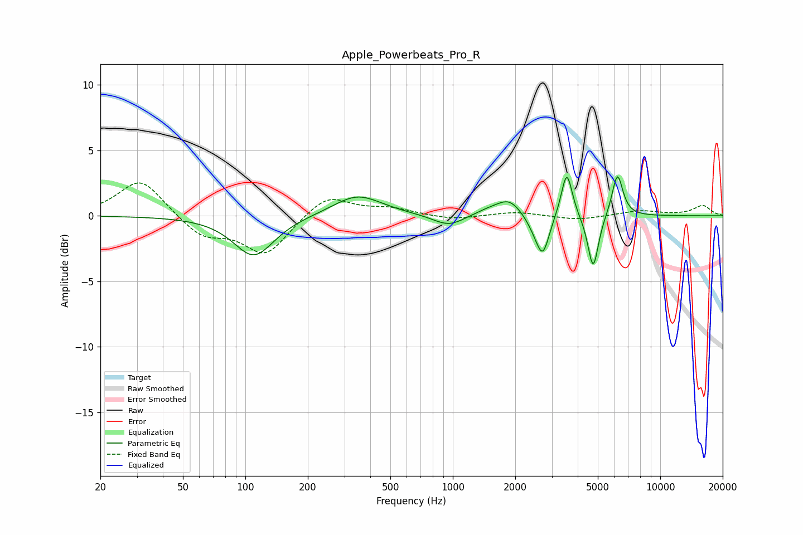

# Apple_Powerbeats_Pro_R
See [usage instructions](https://github.com/jaakkopasanen/AutoEq#usage) for more options and info.

### Parametric EQs
Apply preamp of -3.1 dB when using parametric equalizer.

|   # | Type    |   Fc (Hz) |    Q |   Gain (dB) |
|-----|---------|-----------|------|-------------|
|   1 | Peaking |       110 | 1.45 |        -3.1 |
|   2 | Peaking |       347 | 1.2  |         1.6 |
|   3 | Peaking |       959 | 1.82 |        -0.9 |
|   4 | Peaking |      1523 | 1.63 |         0.5 |
|   5 | Peaking |      1881 | 2.44 |         1.1 |
|   6 | Peaking |      2516 | 3.28 |        -0.9 |
|   7 | Peaking |      2720 | 4.64 |        -2.6 |
|   8 | Peaking |      3542 | 5.4  |         3.6 |
|   9 | Peaking |      4749 | 5.49 |        -4.2 |
|  10 | Peaking |      6217 | 5.31 |         3.3 |

### Fixed Band EQs
When using fixed band (also called graphic) equalizer, apply preamp of **-2.6 dB** (if available) and set gains manually with these parameters.

|   # | Type    |   Fc (Hz) |    Q |   Gain (dB) |
|-----|---------|-----------|------|-------------|
|   1 | Peaking |        31 | 1.41 |         2.9 |
|   2 | Peaking |        62 | 1.41 |        -1.6 |
|   3 | Peaking |       125 | 1.41 |        -2.9 |
|   4 | Peaking |       250 | 1.41 |         1.7 |
|   5 | Peaking |       500 | 1.41 |         0.5 |
|   6 | Peaking |      1000 | 1.41 |        -0.3 |
|   7 | Peaking |      2000 | 1.41 |         0.3 |
|   8 | Peaking |      4000 | 1.41 |        -0.3 |
|   9 | Peaking |      8000 | 1.41 |         0.4 |
|  10 | Peaking |     16000 | 1.41 |         0.8 |

### Graphs

