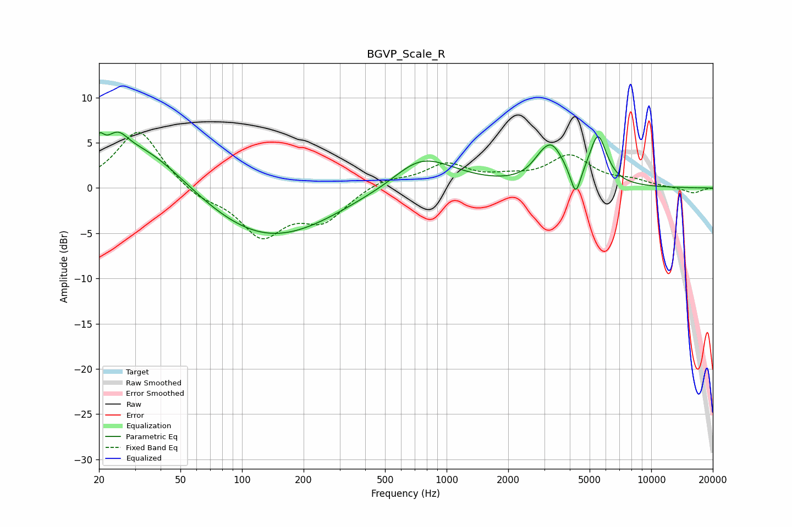

# BGVP_Scale_R
See [usage instructions](https://github.com/jaakkopasanen/AutoEq#usage) for more options and info.

### Parametric EQs
Apply preamp of -6.3 dB when using parametric equalizer.

|   # | Type    |   Fc (Hz) |    Q |   Gain (dB) |
|-----|---------|-----------|------|-------------|
|   1 | Peaking |        20 | 5.99 |         2.1 |
|   2 | Peaking |        25 | 2.75 |         2.3 |
|   3 | Peaking |        33 | 0.65 |         5.3 |
|   4 | Peaking |       132 | 0.43 |        -5.9 |
|   5 | Peaking |       547 | 1.22 |        -0.7 |
|   6 | Peaking |       729 | 0.85 |         4.2 |
|   7 | Peaking |      2862 | 2.96 |         0.7 |
|   8 | Peaking |      3260 | 2.34 |         3.9 |
|   9 | Peaking |      4275 | 5.75 |        -3.1 |
|  10 | Peaking |      5497 | 3.27 |         5.4 |

### Fixed Band EQs
When using fixed band (also called graphic) equalizer, apply preamp of **-6.2 dB** (if available) and set gains manually with these parameters.

|   # | Type    |   Fc (Hz) |    Q |   Gain (dB) |
|-----|---------|-----------|------|-------------|
|   1 | Peaking |        31 | 1.41 |         6.6 |
|   2 | Peaking |        62 | 1.41 |        -1.2 |
|   3 | Peaking |       125 | 1.41 |        -5.1 |
|   4 | Peaking |       250 | 1.41 |        -3.3 |
|   5 | Peaking |       500 | 1.41 |         1   |
|   6 | Peaking |      1000 | 1.41 |         2.5 |
|   7 | Peaking |      2000 | 1.41 |         0.8 |
|   8 | Peaking |      4000 | 1.41 |         3.4 |
|   9 | Peaking |      8000 | 1.41 |         0.7 |
|  10 | Peaking |     16000 | 1.41 |        -0.6 |

### Graphs

