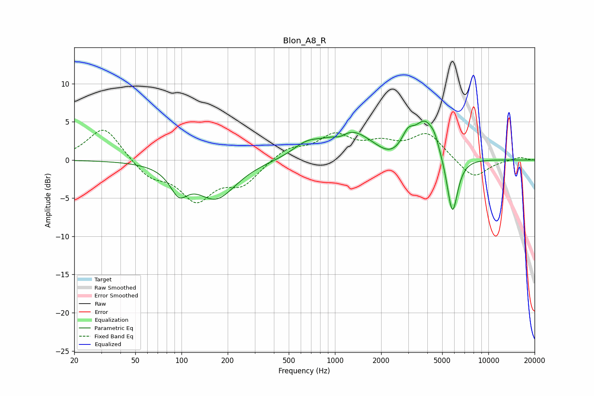

# Blon_A8_R
See [usage instructions](https://github.com/jaakkopasanen/AutoEq#usage) for more options and info.

### Parametric EQs
Apply preamp of -5.2 dB when using parametric equalizer.

|   # | Type    |   Fc (Hz) |    Q |   Gain (dB) |
|-----|---------|-----------|------|-------------|
|   1 | Peaking |        96 | 2.47 |        -3.1 |
|   2 | Peaking |       168 | 1.09 |        -4.9 |
|   3 | Peaking |       653 | 1.55 |         1.5 |
|   4 | Peaking |      1084 | 3.28 |        -0.7 |
|   5 | Peaking |      1246 | 0.98 |         3.8 |
|   6 | Peaking |      2291 | 1.75 |        -1.1 |
|   7 | Peaking |      2989 | 3.6  |         2   |
|   8 | Peaking |      3880 | 1.98 |         4.8 |
|   9 | Peaking |      4464 | 4.88 |         1   |
|  10 | Peaking |      5823 | 3.88 |        -7.9 |

### Fixed Band EQs
When using fixed band (also called graphic) equalizer, apply preamp of **-4.0 dB** (if available) and set gains manually with these parameters.

|   # | Type    |   Fc (Hz) |    Q |   Gain (dB) |
|-----|---------|-----------|------|-------------|
|   1 | Peaking |        31 | 1.41 |         4.5 |
|   2 | Peaking |        62 | 1.41 |        -2.1 |
|   3 | Peaking |       125 | 1.41 |        -4.9 |
|   4 | Peaking |       250 | 1.41 |        -2.9 |
|   5 | Peaking |       500 | 1.41 |         1.6 |
|   6 | Peaking |      1000 | 1.41 |         3   |
|   7 | Peaking |      2000 | 1.41 |         1.8 |
|   8 | Peaking |      4000 | 1.41 |         3.4 |
|   9 | Peaking |      8000 | 1.41 |        -2.5 |
|  10 | Peaking |     16000 | 1.41 |         0.4 |

### Graphs

