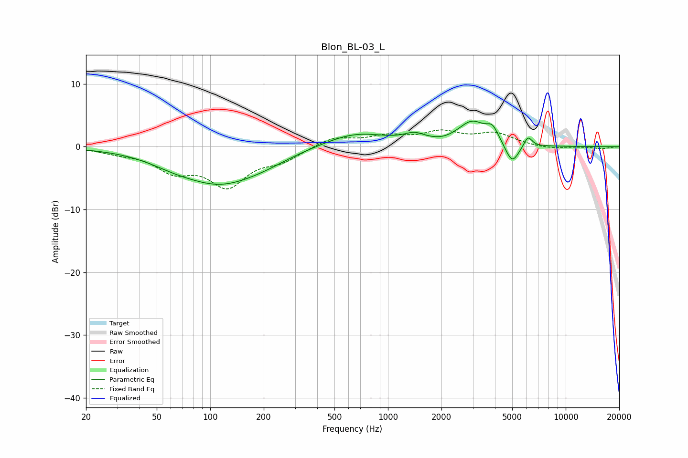

# Blon_BL-03_L
See [usage instructions](https://github.com/jaakkopasanen/AutoEq#usage) for more options and info.

### Parametric EQs
Apply preamp of -4.2 dB when using parametric equalizer.

|   # | Type    |   Fc (Hz) |    Q |   Gain (dB) |
|-----|---------|-----------|------|-------------|
|   1 | Peaking |        61 | 1.05 |        -0.9 |
|   2 | Peaking |       114 | 0.62 |        -5.6 |
|   3 | Peaking |       204 | 1.09 |        -0.7 |
|   4 | Peaking |       657 | 0.78 |         2.3 |
|   5 | Peaking |      1411 | 2.4  |         1.2 |
|   6 | Peaking |      2040 | 2.54 |        -0.2 |
|   7 | Peaking |      2973 | 1.78 |         3.7 |
|   8 | Peaking |      3876 | 4.06 |         2.1 |
|   9 | Peaking |      4995 | 3.62 |        -3.3 |
|  10 | Peaking |      6133 | 6    |         1.7 |

### Fixed Band EQs
When using fixed band (also called graphic) equalizer, apply preamp of **-2.8 dB** (if available) and set gains manually with these parameters.

|   # | Type    |   Fc (Hz) |    Q |   Gain (dB) |
|-----|---------|-----------|------|-------------|
|   1 | Peaking |        31 | 1.41 |        -0.7 |
|   2 | Peaking |        62 | 1.41 |        -3.4 |
|   3 | Peaking |       125 | 1.41 |        -5.8 |
|   4 | Peaking |       250 | 1.41 |        -1.9 |
|   5 | Peaking |       500 | 1.41 |         1.5 |
|   6 | Peaking |      1000 | 1.41 |         1.5 |
|   7 | Peaking |      2000 | 1.41 |         2.1 |
|   8 | Peaking |      4000 | 1.41 |         2   |
|   9 | Peaking |      8000 | 1.41 |        -0.4 |
|  10 | Peaking |     16000 | 1.41 |        -0.3 |

### Graphs

