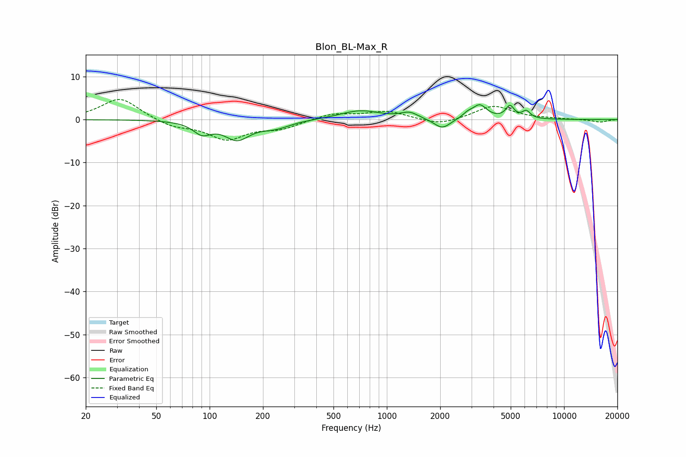

# Blon_BL-Max_R
See [usage instructions](https://github.com/jaakkopasanen/AutoEq#usage) for more options and info.

### Parametric EQs
Apply preamp of -3.5 dB when using parametric equalizer.

|   # | Type    |   Fc (Hz) |    Q |   Gain (dB) |
|-----|---------|-----------|------|-------------|
|   1 | Peaking |        91 | 2.84 |        -2.7 |
|   2 | Peaking |       143 | 1.98 |        -4.2 |
|   3 | Peaking |       235 | 1.66 |        -1.7 |
|   4 | Peaking |       707 | 1.24 |         2.1 |
|   5 | Peaking |      1343 | 2.97 |         1.4 |
|   6 | Peaking |      2054 | 3.05 |        -2.4 |
|   7 | Peaking |      2857 | 5    |         0.9 |
|   8 | Peaking |      3343 | 3.54 |         3.2 |
|   9 | Peaking |      4953 | 6    |         2.8 |
|  10 | Peaking |      6123 | 6    |         1.7 |

### Fixed Band EQs
When using fixed band (also called graphic) equalizer, apply preamp of **-4.8 dB** (if available) and set gains manually with these parameters.

|   # | Type    |   Fc (Hz) |    Q |   Gain (dB) |
|-----|---------|-----------|------|-------------|
|   1 | Peaking |        31 | 1.41 |         5.1 |
|   2 | Peaking |        62 | 1.41 |        -1.7 |
|   3 | Peaking |       125 | 1.41 |        -4.4 |
|   4 | Peaking |       250 | 1.41 |        -1.9 |
|   5 | Peaking |       500 | 1.41 |         1.4 |
|   6 | Peaking |      1000 | 1.41 |         1.9 |
|   7 | Peaking |      2000 | 1.41 |        -1.4 |
|   8 | Peaking |      4000 | 1.41 |         3.2 |
|   9 | Peaking |      8000 | 1.41 |         0.2 |
|  10 | Peaking |     16000 | 1.41 |        -0.6 |

### Graphs

