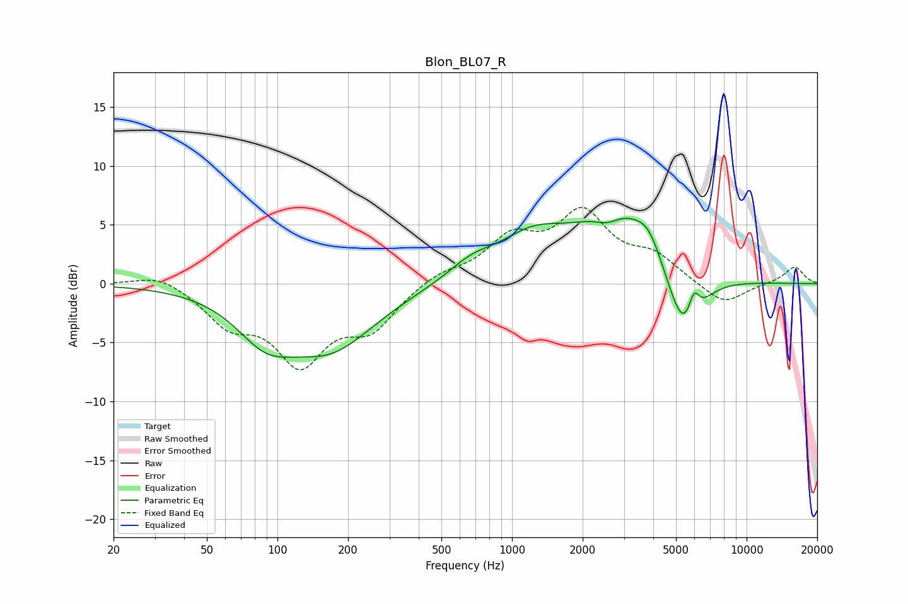

# Blon_BL07_R
See [usage instructions](https://github.com/jaakkopasanen/AutoEq#usage) for more options and info.

### Parametric EQs
Apply preamp of -5.6 dB when using parametric equalizer.

|   # | Type    |   Fc (Hz) |    Q |   Gain (dB) |
|-----|---------|-----------|------|-------------|
|   1 | Peaking |        89 | 1.14 |        -3.4 |
|   2 | Peaking |       169 | 0.73 |        -5.1 |
|   3 | Peaking |       668 | 1.41 |         1.3 |
|   4 | Peaking |      1227 | 0.91 |         3.4 |
|   5 | Peaking |      2565 | 2.3  |        -1.5 |
|   6 | Peaking |      2787 | 0.91 |         5.9 |
|   7 | Peaking |      3827 | 2.47 |         1.9 |
|   8 | Peaking |      5355 | 1.96 |        -5.1 |
|   9 | Peaking |      5924 | 2.26 |        -1.1 |
|  10 | Peaking |      5964 | 5.76 |         2.4 |

### Fixed Band EQs
When using fixed band (also called graphic) equalizer, apply preamp of **-6.6 dB** (if available) and set gains manually with these parameters.

|   # | Type    |   Fc (Hz) |    Q |   Gain (dB) |
|-----|---------|-----------|------|-------------|
|   1 | Peaking |        31 | 1.41 |         1   |
|   2 | Peaking |        62 | 1.41 |        -3   |
|   3 | Peaking |       125 | 1.41 |        -6.2 |
|   4 | Peaking |       250 | 1.41 |        -3.4 |
|   5 | Peaking |       500 | 1.41 |         0.9 |
|   6 | Peaking |      1000 | 1.41 |         3.5 |
|   7 | Peaking |      2000 | 1.41 |         5.5 |
|   8 | Peaking |      4000 | 1.41 |         2   |
|   9 | Peaking |      8000 | 1.41 |        -1.9 |
|  10 | Peaking |     16000 | 1.41 |         1.5 |

### Graphs

