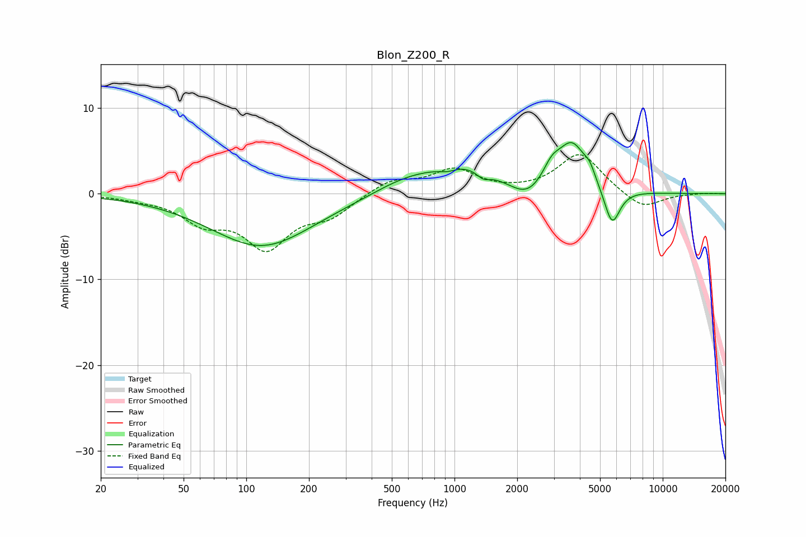

# Blon_Z200_R
See [usage instructions](https://github.com/jaakkopasanen/AutoEq#usage) for more options and info.

### Parametric EQs
Apply preamp of -6.1 dB when using parametric equalizer.

|   # | Type    |   Fc (Hz) |    Q |   Gain (dB) |
|-----|---------|-----------|------|-------------|
|   1 | Peaking |       119 | 0.57 |        -6.2 |
|   2 | Peaking |       573 | 0.93 |         1.4 |
|   3 | Peaking |       924 | 3.05 |        -0.6 |
|   4 | Peaking |      1084 | 0.85 |         3.1 |
|   5 | Peaking |      1374 | 4.45 |        -0.8 |
|   6 | Peaking |      2234 | 1.75 |        -1.9 |
|   7 | Peaking |      2928 | 3.3  |         1.9 |
|   8 | Peaking |      3670 | 1.99 |         5.6 |
|   9 | Peaking |      4463 | 5.28 |         1.2 |
|  10 | Peaking |      5709 | 3.63 |        -4.5 |

### Fixed Band EQs
When using fixed band (also called graphic) equalizer, apply preamp of **-4.7 dB** (if available) and set gains manually with these parameters.

|   # | Type    |   Fc (Hz) |    Q |   Gain (dB) |
|-----|---------|-----------|------|-------------|
|   1 | Peaking |        31 | 1.41 |        -0.4 |
|   2 | Peaking |        62 | 1.41 |        -2.9 |
|   3 | Peaking |       125 | 1.41 |        -5.9 |
|   4 | Peaking |       250 | 1.41 |        -2.3 |
|   5 | Peaking |       500 | 1.41 |         1.6 |
|   6 | Peaking |      1000 | 1.41 |         2.7 |
|   7 | Peaking |      2000 | 1.41 |         0   |
|   8 | Peaking |      4000 | 1.41 |         4.7 |
|   9 | Peaking |      8000 | 1.41 |        -1.9 |
|  10 | Peaking |     16000 | 1.41 |         0.1 |

### Graphs

