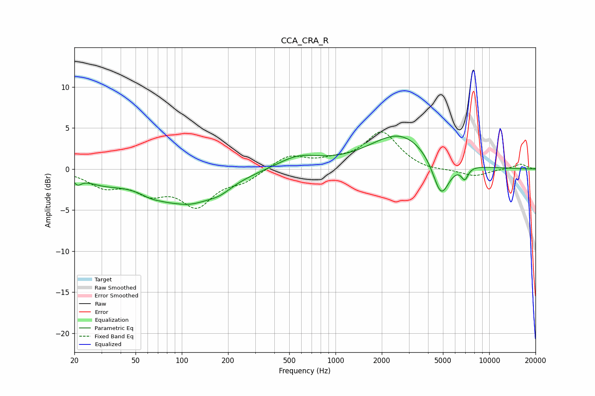

# CCA_CRA_R
See [usage instructions](https://github.com/jaakkopasanen/AutoEq#usage) for more options and info.

### Parametric EQs
Apply preamp of -4.1 dB when using parametric equalizer.

|   # | Type    |   Fc (Hz) |    Q |   Gain (dB) |
|-----|---------|-----------|------|-------------|
|   1 | Peaking |        21 | 5.75 |        -0.8 |
|   2 | Peaking |        30 | 1.08 |        -1.1 |
|   3 | Peaking |        62 | 2.44 |        -0.4 |
|   4 | Peaking |        94 | 1.93 |         0.3 |
|   5 | Peaking |       101 | 0.66 |        -4.4 |
|   6 | Peaking |       177 | 1.94 |        -0.7 |
|   7 | Peaking |       574 | 1.02 |         1.5 |
|   8 | Peaking |      2643 | 0.7  |         4.3 |
|   9 | Peaking |      4860 | 2.53 |        -4.9 |
|  10 | Peaking |      6932 | 5.97 |        -1.5 |

### Fixed Band EQs
When using fixed band (also called graphic) equalizer, apply preamp of **-4.6 dB** (if available) and set gains manually with these parameters.

|   # | Type    |   Fc (Hz) |    Q |   Gain (dB) |
|-----|---------|-----------|------|-------------|
|   1 | Peaking |        31 | 1.41 |        -1.9 |
|   2 | Peaking |        62 | 1.41 |        -2.4 |
|   3 | Peaking |       125 | 1.41 |        -4.1 |
|   4 | Peaking |       250 | 1.41 |        -1.3 |
|   5 | Peaking |       500 | 1.41 |         1.7 |
|   6 | Peaking |      1000 | 1.41 |         0.7 |
|   7 | Peaking |      2000 | 1.41 |         4.4 |
|   8 | Peaking |      4000 | 1.41 |        -0.3 |
|   9 | Peaking |      8000 | 1.41 |        -0.9 |
|  10 | Peaking |     16000 | 1.41 |         0.6 |

### Graphs

