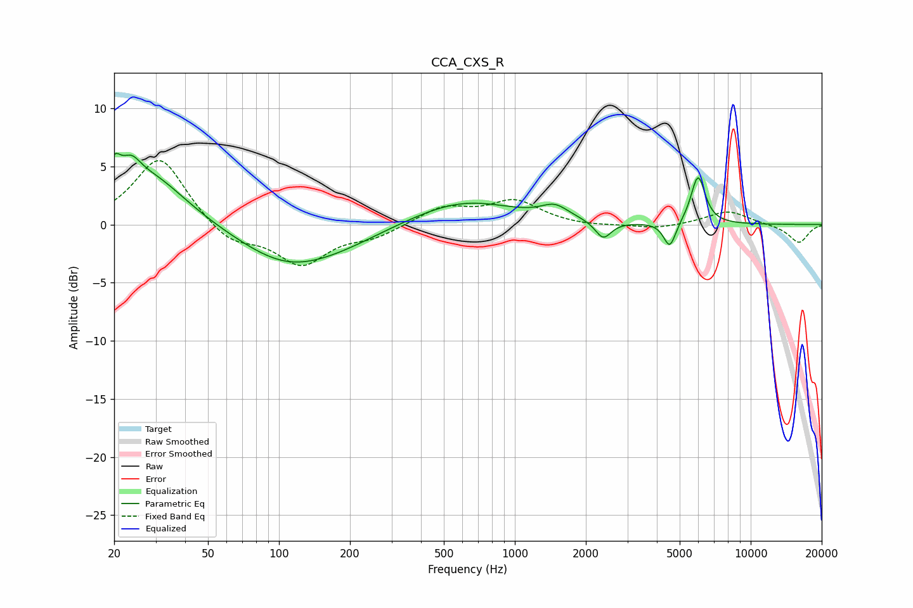

# CCA_CXS_R
See [usage instructions](https://github.com/jaakkopasanen/AutoEq#usage) for more options and info.

### Parametric EQs
Apply preamp of -6.2 dB when using parametric equalizer.

|   # | Type    |   Fc (Hz) |    Q |   Gain (dB) |
|-----|---------|-----------|------|-------------|
|   1 | Peaking |        20 | 5.2  |         2.4 |
|   2 | Peaking |        24 | 3.39 |         1.9 |
|   3 | Peaking |        28 | 0.9  |         4.2 |
|   4 | Peaking |       108 | 0.69 |        -3.2 |
|   5 | Peaking |       187 | 0.73 |        -0.9 |
|   6 | Peaking |       602 | 0.65 |         2.1 |
|   7 | Peaking |      1479 | 2.43 |         1.1 |
|   8 | Peaking |      2369 | 4.2  |        -1.5 |
|   9 | Peaking |      4538 | 5.49 |        -2.2 |
|  10 | Peaking |      5981 | 4.6  |         4.2 |

### Fixed Band EQs
When using fixed band (also called graphic) equalizer, apply preamp of **-5.6 dB** (if available) and set gains manually with these parameters.

|   # | Type    |   Fc (Hz) |    Q |   Gain (dB) |
|-----|---------|-----------|------|-------------|
|   1 | Peaking |        31 | 1.41 |         5.9 |
|   2 | Peaking |        62 | 1.41 |        -1.7 |
|   3 | Peaking |       125 | 1.41 |        -3.3 |
|   4 | Peaking |       250 | 1.41 |        -1   |
|   5 | Peaking |       500 | 1.41 |         1.5 |
|   6 | Peaking |      1000 | 1.41 |         2   |
|   7 | Peaking |      2000 | 1.41 |        -0.2 |
|   8 | Peaking |      4000 | 1.41 |        -0.4 |
|   9 | Peaking |      8000 | 1.41 |         1.2 |
|  10 | Peaking |     16000 | 1.41 |        -1.6 |

### Graphs

