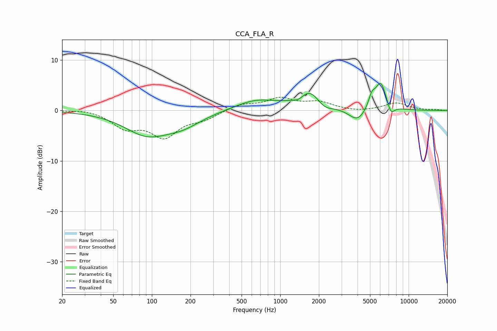

# CCA_FLA_R
See [usage instructions](https://github.com/jaakkopasanen/AutoEq#usage) for more options and info.

### Parametric EQs
Apply preamp of -5.5 dB when using parametric equalizer.

|   # | Type    |   Fc (Hz) |    Q |   Gain (dB) |
|-----|---------|-----------|------|-------------|
|   1 | Peaking |        91 | 0.81 |        -4.5 |
|   2 | Peaking |       175 | 0.96 |        -2.2 |
|   3 | Peaking |       646 | 0.87 |         2   |
|   4 | Peaking |      1406 | 2.55 |        -1.6 |
|   5 | Peaking |      1643 | 1.49 |         4.5 |
|   6 | Peaking |      2201 | 2.39 |        -1.4 |
|   7 | Peaking |      4001 | 2.1  |        -2.6 |
|   8 | Peaking |      5158 | 5.45 |         2.2 |
|   9 | Peaking |      6062 | 3    |         5.8 |
|  10 | Peaking |      7261 | 4.68 |        -2.2 |

### Fixed Band EQs
When using fixed band (also called graphic) equalizer, apply preamp of **-2.7 dB** (if available) and set gains manually with these parameters.

|   # | Type    |   Fc (Hz) |    Q |   Gain (dB) |
|-----|---------|-----------|------|-------------|
|   1 | Peaking |        31 | 1.41 |         0.4 |
|   2 | Peaking |        62 | 1.41 |        -3.1 |
|   3 | Peaking |       125 | 1.41 |        -4.9 |
|   4 | Peaking |       250 | 1.41 |        -1.5 |
|   5 | Peaking |       500 | 1.41 |         1.2 |
|   6 | Peaking |      1000 | 1.41 |         2.2 |
|   7 | Peaking |      2000 | 1.41 |         1.5 |
|   8 | Peaking |      4000 | 1.41 |        -0.3 |
|   9 | Peaking |      8000 | 1.41 |         1.5 |
|  10 | Peaking |     16000 | 1.41 |         0.1 |

### Graphs

