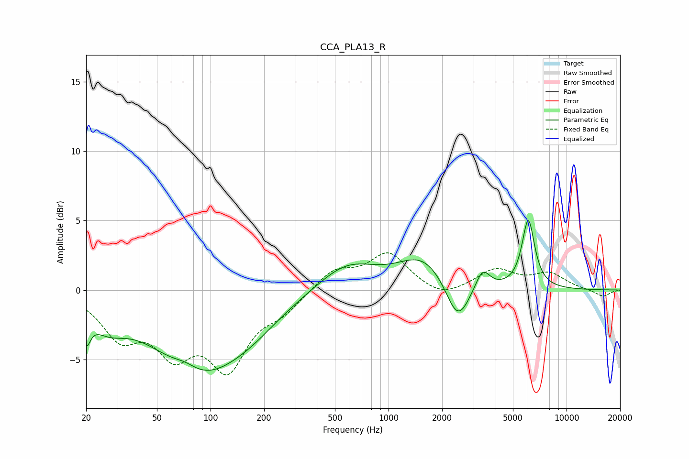

# CCA_PLA13_R
See [usage instructions](https://github.com/jaakkopasanen/AutoEq#usage) for more options and info.

### Parametric EQs
Apply preamp of -5.1 dB when using parametric equalizer.

|   # | Type    |   Fc (Hz) |    Q |   Gain (dB) |
|-----|---------|-----------|------|-------------|
|   1 | Peaking |        20 | 5.97 |        -2   |
|   2 | Peaking |        26 | 1.37 |        -1.6 |
|   3 | Peaking |        72 | 2.08 |         0.6 |
|   4 | Peaking |        87 | 0.55 |        -5.7 |
|   5 | Peaking |       171 | 0.91 |        -0.8 |
|   6 | Peaking |       584 | 0.87 |         2   |
|   7 | Peaking |      1564 | 1.01 |         2.3 |
|   8 | Peaking |      2448 | 2.12 |        -3.1 |
|   9 | Peaking |      3374 | 3.55 |         1.5 |
|  10 | Peaking |      6099 | 3.94 |         4.9 |

### Fixed Band EQs
When using fixed band (also called graphic) equalizer, apply preamp of **-2.8 dB** (if available) and set gains manually with these parameters.

|   # | Type    |   Fc (Hz) |    Q |   Gain (dB) |
|-----|---------|-----------|------|-------------|
|   1 | Peaking |        31 | 1.41 |        -3   |
|   2 | Peaking |        62 | 1.41 |        -3.8 |
|   3 | Peaking |       125 | 1.41 |        -5.1 |
|   4 | Peaking |       250 | 1.41 |        -1.3 |
|   5 | Peaking |       500 | 1.41 |         1.4 |
|   6 | Peaking |      1000 | 1.41 |         2.6 |
|   7 | Peaking |      2000 | 1.41 |        -0.7 |
|   8 | Peaking |      4000 | 1.41 |         1.4 |
|   9 | Peaking |      8000 | 1.41 |         1.1 |
|  10 | Peaking |     16000 | 1.41 |        -0.5 |

### Graphs

