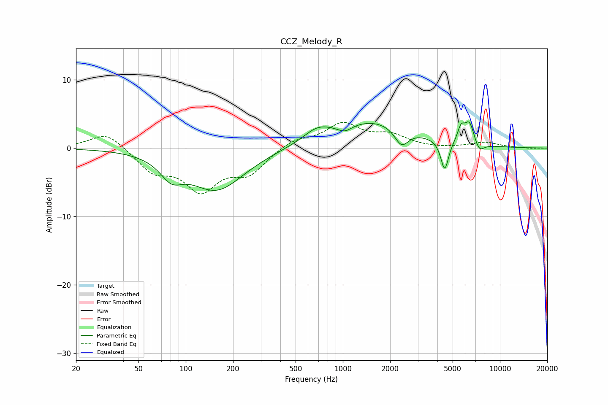

# CCZ_Melody_R
See [usage instructions](https://github.com/jaakkopasanen/AutoEq#usage) for more options and info.

### Parametric EQs
Apply preamp of -3.9 dB when using parametric equalizer.

|   # | Type    |   Fc (Hz) |    Q |   Gain (dB) |
|-----|---------|-----------|------|-------------|
|   1 | Peaking |        81 | 2.01 |        -2.7 |
|   2 | Peaking |       157 | 0.81 |        -6   |
|   3 | Peaking |       688 | 1.57 |         1.8 |
|   4 | Peaking |      1029 | 3.12 |        -0.9 |
|   5 | Peaking |      1577 | 0.57 |         3.9 |
|   6 | Peaking |      2364 | 3.17 |        -2.6 |
|   7 | Peaking |      4451 | 5.69 |        -4.5 |
|   8 | Peaking |      5658 | 6    |         2.1 |
|   9 | Peaking |      6397 | 4.48 |         3.2 |
|  10 | Peaking |      7389 | 4.55 |        -1.4 |

### Fixed Band EQs
When using fixed band (also called graphic) equalizer, apply preamp of **-3.9 dB** (if available) and set gains manually with these parameters.

|   # | Type    |   Fc (Hz) |    Q |   Gain (dB) |
|-----|---------|-----------|------|-------------|
|   1 | Peaking |        31 | 1.41 |         2.4 |
|   2 | Peaking |        62 | 1.41 |        -3.1 |
|   3 | Peaking |       125 | 1.41 |        -5.7 |
|   4 | Peaking |       250 | 1.41 |        -3.4 |
|   5 | Peaking |       500 | 1.41 |         1.3 |
|   6 | Peaking |      1000 | 1.41 |         3.4 |
|   7 | Peaking |      2000 | 1.41 |         1.7 |
|   8 | Peaking |      4000 | 1.41 |        -0.1 |
|   9 | Peaking |      8000 | 1.41 |         0.8 |
|  10 | Peaking |     16000 | 1.41 |        -0.1 |

### Graphs

