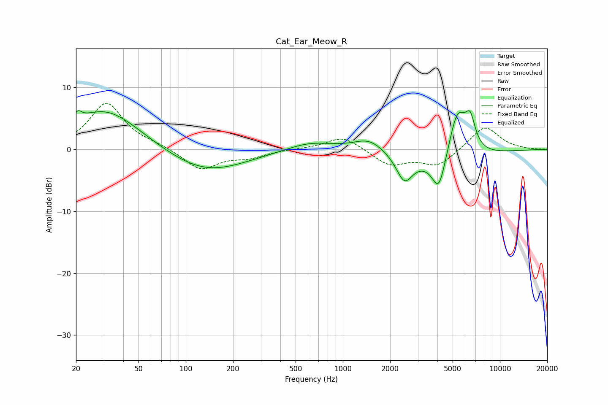

# Cat_Ear_Meow_R
See [usage instructions](https://github.com/jaakkopasanen/AutoEq#usage) for more options and info.

### Parametric EQs
Apply preamp of -6.3 dB when using parametric equalizer.

|   # | Type    |   Fc (Hz) |    Q |   Gain (dB) |
|-----|---------|-----------|------|-------------|
|   1 | Peaking |        21 | 5.92 |         1.4 |
|   2 | Peaking |        31 | 0.63 |         6.6 |
|   3 | Peaking |       133 | 0.56 |        -3.9 |
|   4 | Peaking |       619 | 0.95 |         1.4 |
|   5 | Peaking |      1478 | 1.43 |         2.1 |
|   6 | Peaking |      2466 | 2.77 |        -4.1 |
|   7 | Peaking |      4091 | 3.23 |        -5.7 |
|   8 | Peaking |      4187 | 0.57 |        -2.4 |
|   9 | Peaking |      5358 | 2.38 |         8.1 |
|  10 | Peaking |      6470 | 4.26 |         4.4 |

### Fixed Band EQs
When using fixed band (also called graphic) equalizer, apply preamp of **-7.5 dB** (if available) and set gains manually with these parameters.

|   # | Type    |   Fc (Hz) |    Q |   Gain (dB) |
|-----|---------|-----------|------|-------------|
|   1 | Peaking |        31 | 1.41 |         7.5 |
|   2 | Peaking |        62 | 1.41 |         0.5 |
|   3 | Peaking |       125 | 1.41 |        -3.3 |
|   4 | Peaking |       250 | 1.41 |        -1.2 |
|   5 | Peaking |       500 | 1.41 |         0   |
|   6 | Peaking |      1000 | 1.41 |         2.2 |
|   7 | Peaking |      2000 | 1.41 |        -2.5 |
|   8 | Peaking |      4000 | 1.41 |        -2.6 |
|   9 | Peaking |      8000 | 1.41 |         3.9 |
|  10 | Peaking |     16000 | 1.41 |        -0   |

### Graphs

