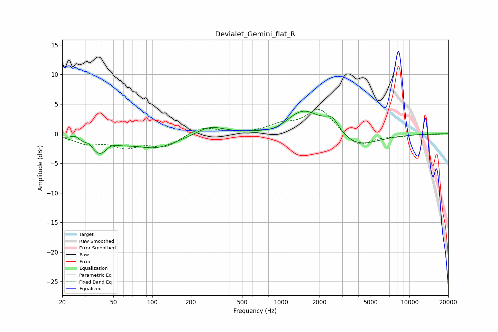

# Devialet_Gemini_flat_R
See [usage instructions](https://github.com/jaakkopasanen/AutoEq#usage) for more options and info.

### Parametric EQs
Apply preamp of -3.9 dB when using parametric equalizer.

|   # | Type    |   Fc (Hz) |    Q |   Gain (dB) |
|-----|---------|-----------|------|-------------|
|   1 | Peaking |        25 | 3.93 |         0.9 |
|   2 | Peaking |        33 | 3.9  |         1.1 |
|   3 | Peaking |        40 | 1.39 |        -4.2 |
|   4 | Peaking |        47 | 2.6  |         1.7 |
|   5 | Peaking |       108 | 0.85 |        -2.2 |
|   6 | Peaking |       282 | 1.39 |         1.4 |
|   7 | Peaking |       926 | 1.31 |        -0.9 |
|   8 | Peaking |      1497 | 0.99 |         4.4 |
|   9 | Peaking |      2503 | 2.68 |         2.3 |
|  10 | Peaking |      3866 | 0.86 |        -2.4 |

### Fixed Band EQs
When using fixed band (also called graphic) equalizer, apply preamp of **-4.2 dB** (if available) and set gains manually with these parameters.

|   # | Type    |   Fc (Hz) |    Q |   Gain (dB) |
|-----|---------|-----------|------|-------------|
|   1 | Peaking |        31 | 1.41 |        -1.5 |
|   2 | Peaking |        62 | 1.41 |        -2   |
|   3 | Peaking |       125 | 1.41 |        -2.1 |
|   4 | Peaking |       250 | 1.41 |         1.3 |
|   5 | Peaking |       500 | 1.41 |        -0   |
|   6 | Peaking |      1000 | 1.41 |         1.3 |
|   7 | Peaking |      2000 | 1.41 |         4.3 |
|   8 | Peaking |      4000 | 1.41 |        -2.4 |
|   9 | Peaking |      8000 | 1.41 |        -0.4 |
|  10 | Peaking |     16000 | 1.41 |        -0.1 |

### Graphs

