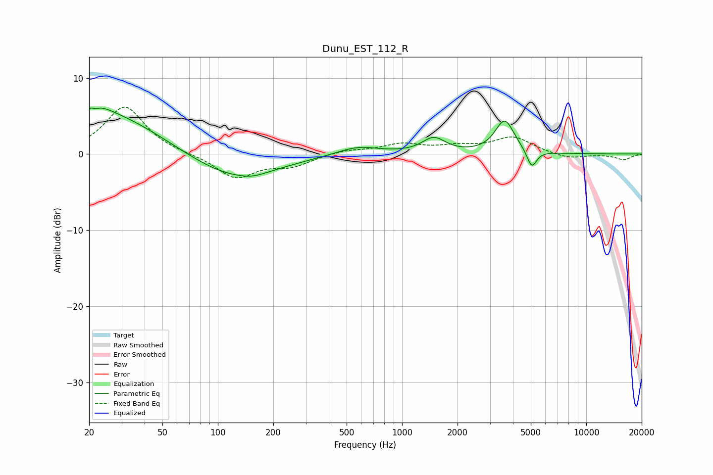

# Dunu_EST_112_R
See [usage instructions](https://github.com/jaakkopasanen/AutoEq#usage) for more options and info.

### Parametric EQs
Apply preamp of -6.1 dB when using parametric equalizer.

|   # | Type    |   Fc (Hz) |    Q |   Gain (dB) |
|-----|---------|-----------|------|-------------|
|   1 | Peaking |        21 | 6    |         2.1 |
|   2 | Peaking |        21 | 5.91 |        -2.1 |
|   3 | Peaking |        22 | 2.06 |         1.1 |
|   4 | Peaking |        25 | 0.48 |         5.4 |
|   5 | Peaking |       120 | 0.58 |        -3.4 |
|   6 | Peaking |       154 | 2.04 |        -0.4 |
|   7 | Peaking |       574 | 1.22 |         1.1 |
|   8 | Peaking |      1486 | 2.27 |         2   |
|   9 | Peaking |      3608 | 2.71 |         4.4 |
|  10 | Peaking |      5060 | 5.32 |        -2.4 |

### Fixed Band EQs
When using fixed band (also called graphic) equalizer, apply preamp of **-6.3 dB** (if available) and set gains manually with these parameters.

|   # | Type    |   Fc (Hz) |    Q |   Gain (dB) |
|-----|---------|-----------|------|-------------|
|   1 | Peaking |        31 | 1.41 |         6.3 |
|   2 | Peaking |        62 | 1.41 |        -0   |
|   3 | Peaking |       125 | 1.41 |        -3.1 |
|   4 | Peaking |       250 | 1.41 |        -1.4 |
|   5 | Peaking |       500 | 1.41 |         0.5 |
|   6 | Peaking |      1000 | 1.41 |         1.2 |
|   7 | Peaking |      2000 | 1.41 |         0.8 |
|   8 | Peaking |      4000 | 1.41 |         2.2 |
|   9 | Peaking |      8000 | 1.41 |        -0.7 |
|  10 | Peaking |     16000 | 1.41 |        -0.7 |

### Graphs

