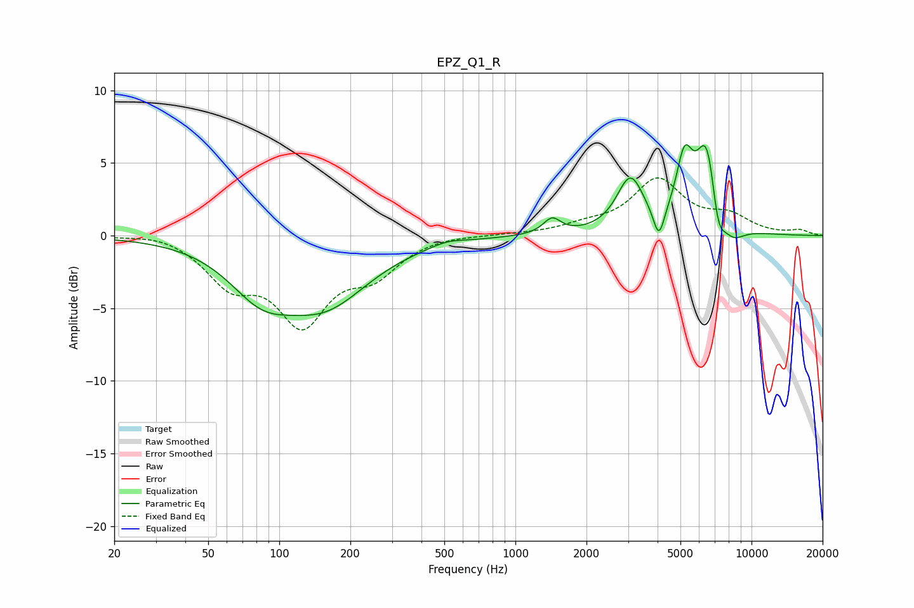

# EPZ_Q1_R
See [usage instructions](https://github.com/jaakkopasanen/AutoEq#usage) for more options and info.

### Parametric EQs
Apply preamp of -6.4 dB when using parametric equalizer.

|   # | Type    |   Fc (Hz) |    Q |   Gain (dB) |
|-----|---------|-----------|------|-------------|
|   1 | Peaking |        84 | 1.03 |        -3   |
|   2 | Peaking |       157 | 0.76 |        -4.2 |
|   3 | Peaking |       514 | 2.09 |         0.3 |
|   4 | Peaking |      1430 | 3.88 |         1.1 |
|   5 | Peaking |      3067 | 2.48 |         3.7 |
|   6 | Peaking |      4053 | 6    |        -2.2 |
|   7 | Peaking |      5197 | 3.99 |         4.1 |
|   8 | Peaking |      6507 | 2.83 |         6.8 |
|   9 | Peaking |      7185 | 4.3  |        -3.2 |
|  10 | Peaking |      8305 | 2.63 |        -1.2 |

### Fixed Band EQs
When using fixed band (also called graphic) equalizer, apply preamp of **-4.1 dB** (if available) and set gains manually with these parameters.

|   # | Type    |   Fc (Hz) |    Q |   Gain (dB) |
|-----|---------|-----------|------|-------------|
|   1 | Peaking |        31 | 1.41 |         0.3 |
|   2 | Peaking |        62 | 1.41 |        -2.9 |
|   3 | Peaking |       125 | 1.41 |        -5.6 |
|   4 | Peaking |       250 | 1.41 |        -2.3 |
|   5 | Peaking |       500 | 1.41 |         0.1 |
|   6 | Peaking |      1000 | 1.41 |         0.1 |
|   7 | Peaking |      2000 | 1.41 |         0.5 |
|   8 | Peaking |      4000 | 1.41 |         3.7 |
|   9 | Peaking |      8000 | 1.41 |         1.2 |
|  10 | Peaking |     16000 | 1.41 |         0.3 |

### Graphs

