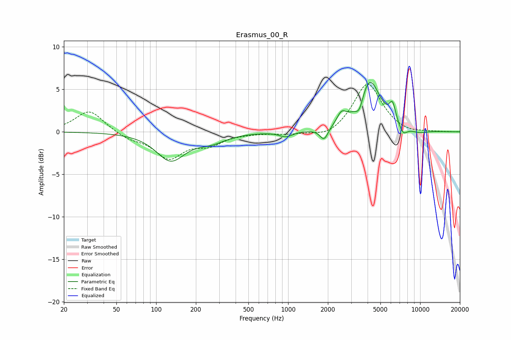

# Erasmus_00_R
See [usage instructions](https://github.com/jaakkopasanen/AutoEq#usage) for more options and info.

### Parametric EQs
Apply preamp of -5.9 dB when using parametric equalizer.

|   # | Type    |   Fc (Hz) |    Q |   Gain (dB) |
|-----|---------|-----------|------|-------------|
|   1 | Peaking |       129 | 1.31 |        -3.3 |
|   2 | Peaking |       261 | 1.28 |        -1   |
|   3 | Peaking |       962 | 2.92 |        -0.6 |
|   4 | Peaking |      1871 | 4.58 |        -1.5 |
|   5 | Peaking |      2537 | 4.07 |         1.3 |
|   6 | Peaking |      3463 | 4.65 |        -1.6 |
|   7 | Peaking |      4139 | 1.74 |         6.1 |
|   8 | Peaking |      6172 | 5.66 |         2.1 |
|   9 | Peaking |      7425 | 4.22 |        -1.1 |
|  10 | Peaking |      9782 | 1.96 |        -0.4 |

### Fixed Band EQs
When using fixed band (also called graphic) equalizer, apply preamp of **-5.7 dB** (if available) and set gains manually with these parameters.

|   # | Type    |   Fc (Hz) |    Q |   Gain (dB) |
|-----|---------|-----------|------|-------------|
|   1 | Peaking |        31 | 1.41 |         2.6 |
|   2 | Peaking |        62 | 1.41 |        -0.8 |
|   3 | Peaking |       125 | 1.41 |        -3   |
|   4 | Peaking |       250 | 1.41 |        -1.3 |
|   5 | Peaking |       500 | 1.41 |        -0.1 |
|   6 | Peaking |      1000 | 1.41 |        -0.3 |
|   7 | Peaking |      2000 | 1.41 |        -0.8 |
|   8 | Peaking |      4000 | 1.41 |         5.8 |
|   9 | Peaking |      8000 | 1.41 |        -0.3 |
|  10 | Peaking |     16000 | 1.41 |        -0   |

### Graphs

