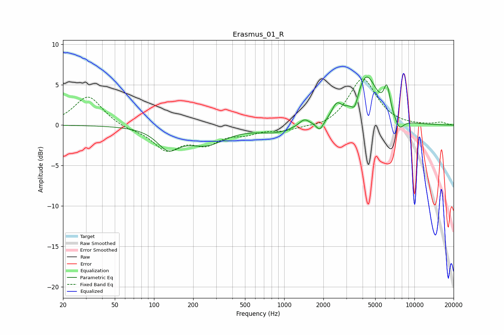

# Erasmus_01_R
See [usage instructions](https://github.com/jaakkopasanen/AutoEq#usage) for more options and info.

### Parametric EQs
Apply preamp of -6.0 dB when using parametric equalizer.

|   # | Type    |   Fc (Hz) |    Q |   Gain (dB) |
|-----|---------|-----------|------|-------------|
|   1 | Peaking |       128 | 1.7  |        -2.4 |
|   2 | Peaking |       252 | 0.96 |        -2.2 |
|   3 | Peaking |       859 | 1.11 |        -0.8 |
|   4 | Peaking |      1427 | 3.7  |         0.8 |
|   5 | Peaking |      1878 | 5.13 |        -1.2 |
|   6 | Peaking |      2529 | 3.85 |         1.7 |
|   7 | Peaking |      3486 | 5.46 |        -1.7 |
|   8 | Peaking |      4265 | 1.7  |         6.1 |
|   9 | Peaking |      6156 | 5.77 |         3.2 |
|  10 | Peaking |      7657 | 3.85 |        -1.4 |

### Fixed Band EQs
When using fixed band (also called graphic) equalizer, apply preamp of **-5.8 dB** (if available) and set gains manually with these parameters.

|   # | Type    |   Fc (Hz) |    Q |   Gain (dB) |
|-----|---------|-----------|------|-------------|
|   1 | Peaking |        31 | 1.41 |         3.7 |
|   2 | Peaking |        62 | 1.41 |        -0.4 |
|   3 | Peaking |       125 | 1.41 |        -2.9 |
|   4 | Peaking |       250 | 1.41 |        -2   |
|   5 | Peaking |       500 | 1.41 |        -0.9 |
|   6 | Peaking |      1000 | 1.41 |        -0.6 |
|   7 | Peaking |      2000 | 1.41 |        -0.4 |
|   8 | Peaking |      4000 | 1.41 |         5.8 |
|   9 | Peaking |      8000 | 1.41 |        -0.1 |
|  10 | Peaking |     16000 | 1.41 |         0.3 |

### Graphs

