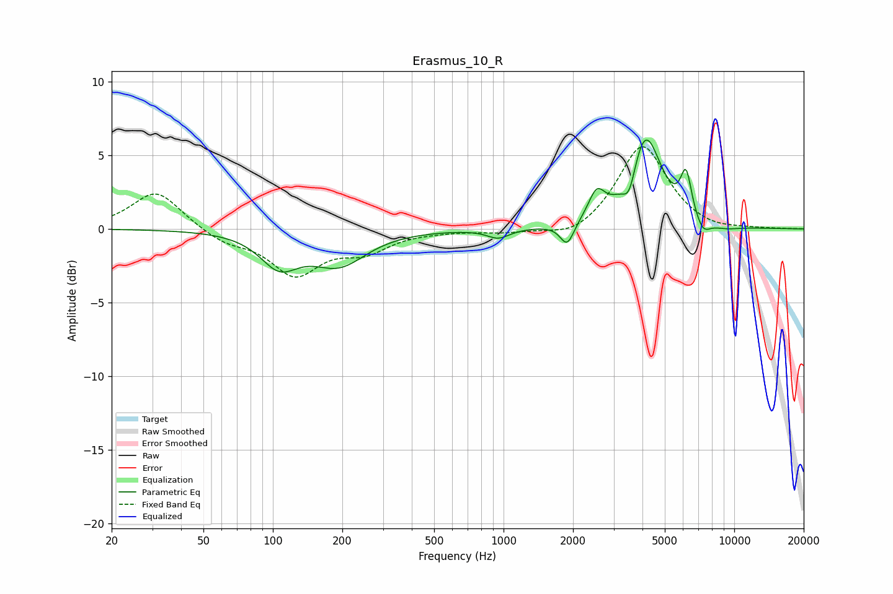

# Erasmus_10_R
See [usage instructions](https://github.com/jaakkopasanen/AutoEq#usage) for more options and info.

### Parametric EQs
Apply preamp of -6.1 dB when using parametric equalizer.

|   # | Type    |   Fc (Hz) |    Q |   Gain (dB) |
|-----|---------|-----------|------|-------------|
|   1 | Peaking |       107 | 1.73 |        -2.2 |
|   2 | Peaking |       193 | 1.2  |        -2.3 |
|   3 | Peaking |       950 | 2.91 |        -0.6 |
|   4 | Peaking |      1887 | 4.73 |        -1.6 |
|   5 | Peaking |      2532 | 4.01 |         1.8 |
|   6 | Peaking |      3510 | 5.04 |        -1.8 |
|   7 | Peaking |      4109 | 2.02 |         6.4 |
|   8 | Peaking |      6183 | 5.85 |         2.9 |
|   9 | Peaking |      7316 | 4.24 |        -1   |
|  10 | Peaking |      9132 | 1.95 |        -0.3 |

### Fixed Band EQs
When using fixed band (also called graphic) equalizer, apply preamp of **-5.7 dB** (if available) and set gains manually with these parameters.

|   # | Type    |   Fc (Hz) |    Q |   Gain (dB) |
|-----|---------|-----------|------|-------------|
|   1 | Peaking |        31 | 1.41 |         2.6 |
|   2 | Peaking |        62 | 1.41 |        -0.8 |
|   3 | Peaking |       125 | 1.41 |        -3   |
|   4 | Peaking |       250 | 1.41 |        -1.3 |
|   5 | Peaking |       500 | 1.41 |        -0.1 |
|   6 | Peaking |      1000 | 1.41 |        -0.2 |
|   7 | Peaking |      2000 | 1.41 |        -0.8 |
|   8 | Peaking |      4000 | 1.41 |         5.8 |
|   9 | Peaking |      8000 | 1.41 |        -0.3 |
|  10 | Peaking |     16000 | 1.41 |         0   |

### Graphs

