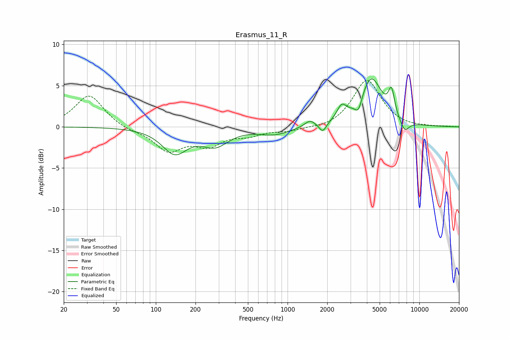

# Erasmus_11_R
See [usage instructions](https://github.com/jaakkopasanen/AutoEq#usage) for more options and info.

### Parametric EQs
Apply preamp of -5.9 dB when using parametric equalizer.

|   # | Type    |   Fc (Hz) |    Q |   Gain (dB) |
|-----|---------|-----------|------|-------------|
|   1 | Peaking |       139 | 1.49 |        -3   |
|   2 | Peaking |       283 | 1.41 |        -2   |
|   3 | Peaking |       799 | 1.21 |        -0.9 |
|   4 | Peaking |      1478 | 3.61 |         0.8 |
|   5 | Peaking |      1849 | 5.13 |        -1.2 |
|   6 | Peaking |      2575 | 3.92 |         1.7 |
|   7 | Peaking |      3456 | 5.3  |        -1.6 |
|   8 | Peaking |      4307 | 1.69 |         5.9 |
|   9 | Peaking |      6148 | 5.87 |         3   |
|  10 | Peaking |      7730 | 3.86 |        -1.4 |

### Fixed Band EQs
When using fixed band (also called graphic) equalizer, apply preamp of **-5.7 dB** (if available) and set gains manually with these parameters.

|   # | Type    |   Fc (Hz) |    Q |   Gain (dB) |
|-----|---------|-----------|------|-------------|
|   1 | Peaking |        31 | 1.41 |         3.9 |
|   2 | Peaking |        62 | 1.41 |        -0.4 |
|   3 | Peaking |       125 | 1.41 |        -2.8 |
|   4 | Peaking |       250 | 1.41 |        -2   |
|   5 | Peaking |       500 | 1.41 |        -0.8 |
|   6 | Peaking |      1000 | 1.41 |        -0.5 |
|   7 | Peaking |      2000 | 1.41 |        -0.3 |
|   8 | Peaking |      4000 | 1.41 |         5.7 |
|   9 | Peaking |      8000 | 1.41 |        -0.1 |
|  10 | Peaking |     16000 | 1.41 |         0   |

### Graphs

