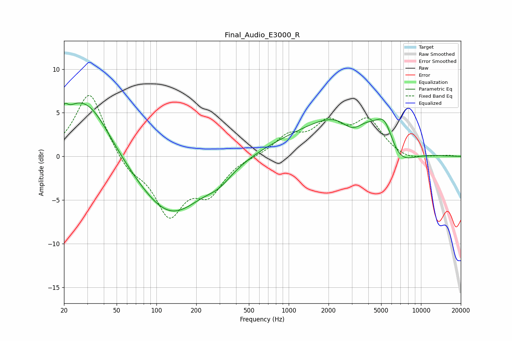

# Final_Audio_E3000_R
See [usage instructions](https://github.com/jaakkopasanen/AutoEq#usage) for more options and info.

### Parametric EQs
Apply preamp of -6.2 dB when using parametric equalizer.

|   # | Type    |   Fc (Hz) |    Q |   Gain (dB) |
|-----|---------|-----------|------|-------------|
|   1 | Peaking |        20 | 5.39 |         1.7 |
|   2 | Peaking |        24 | 1.55 |         1.8 |
|   3 | Peaking |        32 | 0.85 |         5.7 |
|   4 | Peaking |       127 | 0.57 |        -6.8 |
|   5 | Peaking |       298 | 1.5  |        -1.2 |
|   6 | Peaking |      1802 | 0.36 |         2.6 |
|   7 | Peaking |      3028 | 1.59 |        -2.7 |
|   8 | Peaking |      3226 | 0.67 |         4   |
|   9 | Peaking |      5332 | 2.27 |         2.7 |
|  10 | Peaking |      6717 | 1.16 |        -2.8 |

### Fixed Band EQs
When using fixed band (also called graphic) equalizer, apply preamp of **-7.1 dB** (if available) and set gains manually with these parameters.

|   # | Type    |   Fc (Hz) |    Q |   Gain (dB) |
|-----|---------|-----------|------|-------------|
|   1 | Peaking |        31 | 1.41 |         7.5 |
|   2 | Peaking |        62 | 1.41 |        -1.7 |
|   3 | Peaking |       125 | 1.41 |        -6.4 |
|   4 | Peaking |       250 | 1.41 |        -3.7 |
|   5 | Peaking |       500 | 1.41 |         0   |
|   6 | Peaking |      1000 | 1.41 |         2.2 |
|   7 | Peaking |      2000 | 1.41 |         3.4 |
|   8 | Peaking |      4000 | 1.41 |         3.8 |
|   9 | Peaking |      8000 | 1.41 |        -0.5 |
|  10 | Peaking |     16000 | 1.41 |         0.1 |

### Graphs

