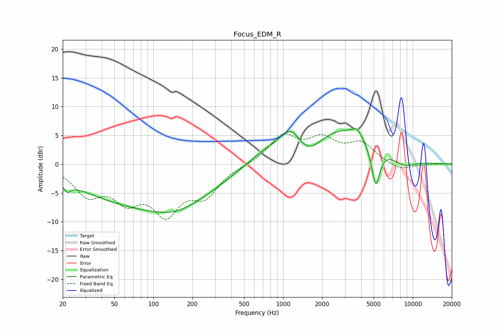

# Focus_EDM_R
See [usage instructions](https://github.com/jaakkopasanen/AutoEq#usage) for more options and info.

### Parametric EQs
Apply preamp of -6.3 dB when using parametric equalizer.

|   # | Type    |   Fc (Hz) |    Q |   Gain (dB) |
|-----|---------|-----------|------|-------------|
|   1 | Peaking |        22 | 5.6  |        -1.4 |
|   2 | Peaking |        92 | 0.26 |        -7.2 |
|   3 | Peaking |       151 | 0.83 |        -1.7 |
|   4 | Peaking |       704 | 0.89 |         2.1 |
|   5 | Peaking |      1126 | 1.79 |         3.7 |
|   6 | Peaking |      1594 | 1.56 |        -2.7 |
|   7 | Peaking |      2868 | 0.51 |         6.2 |
|   8 | Peaking |      3723 | 3.84 |         1.4 |
|   9 | Peaking |      5180 | 4.17 |        -7.3 |
|  10 | Peaking |      8495 | 1.4  |        -1.7 |

### Fixed Band EQs
When using fixed band (also called graphic) equalizer, apply preamp of **-5.4 dB** (if available) and set gains manually with these parameters.

|   # | Type    |   Fc (Hz) |    Q |   Gain (dB) |
|-----|---------|-----------|------|-------------|
|   1 | Peaking |        31 | 1.41 |        -4.8 |
|   2 | Peaking |        62 | 1.41 |        -5.1 |
|   3 | Peaking |       125 | 1.41 |        -7.6 |
|   4 | Peaking |       250 | 1.41 |        -4.8 |
|   5 | Peaking |       500 | 1.41 |        -0.1 |
|   6 | Peaking |      1000 | 1.41 |         4.7 |
|   7 | Peaking |      2000 | 1.41 |         3.8 |
|   8 | Peaking |      4000 | 1.41 |         3.3 |
|   9 | Peaking |      8000 | 1.41 |        -1.2 |
|  10 | Peaking |     16000 | 1.41 |         0   |

### Graphs

