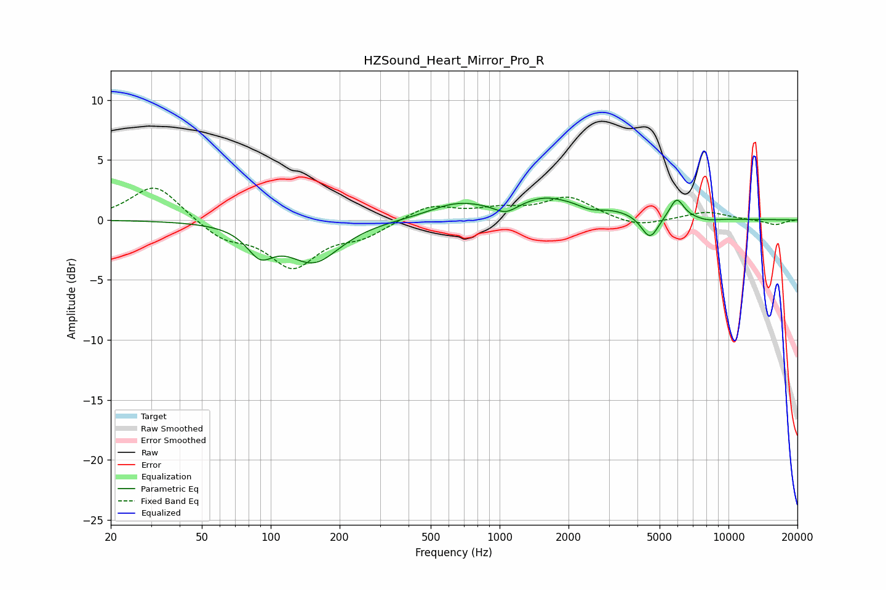

# HZSound_Heart_Mirror_Pro_R
See [usage instructions](https://github.com/jaakkopasanen/AutoEq#usage) for more options and info.

### Parametric EQs
Apply preamp of -1.9 dB when using parametric equalizer.

|   # | Type    |   Fc (Hz) |    Q |   Gain (dB) |
|-----|---------|-----------|------|-------------|
|   1 | Peaking |        90 | 2.45 |        -2.2 |
|   2 | Peaking |       154 | 1.23 |        -3.4 |
|   3 | Peaking |       637 | 1.26 |         0.9 |
|   4 | Peaking |      1065 | 2.65 |        -1   |
|   5 | Peaking |      1571 | 2.34 |         0.2 |
|   6 | Peaking |      1680 | 0.55 |         1.8 |
|   7 | Peaking |      2483 | 2.51 |        -0.6 |
|   8 | Peaking |      4535 | 3.63 |        -2.1 |
|   9 | Peaking |      5937 | 4.48 |         1.7 |
|  10 | Peaking |      8088 | 2.58 |        -0.2 |

### Fixed Band EQs
When using fixed band (also called graphic) equalizer, apply preamp of **-2.7 dB** (if available) and set gains manually with these parameters.

|   # | Type    |   Fc (Hz) |    Q |   Gain (dB) |
|-----|---------|-----------|------|-------------|
|   1 | Peaking |        31 | 1.41 |         3   |
|   2 | Peaking |        62 | 1.41 |        -1.5 |
|   3 | Peaking |       125 | 1.41 |        -3.7 |
|   4 | Peaking |       250 | 1.41 |        -1.2 |
|   5 | Peaking |       500 | 1.41 |         1.2 |
|   6 | Peaking |      1000 | 1.41 |         0.7 |
|   7 | Peaking |      2000 | 1.41 |         1.8 |
|   8 | Peaking |      4000 | 1.41 |        -0.7 |
|   9 | Peaking |      8000 | 1.41 |         0.7 |
|  10 | Peaking |     16000 | 1.41 |        -0.4 |

### Graphs

