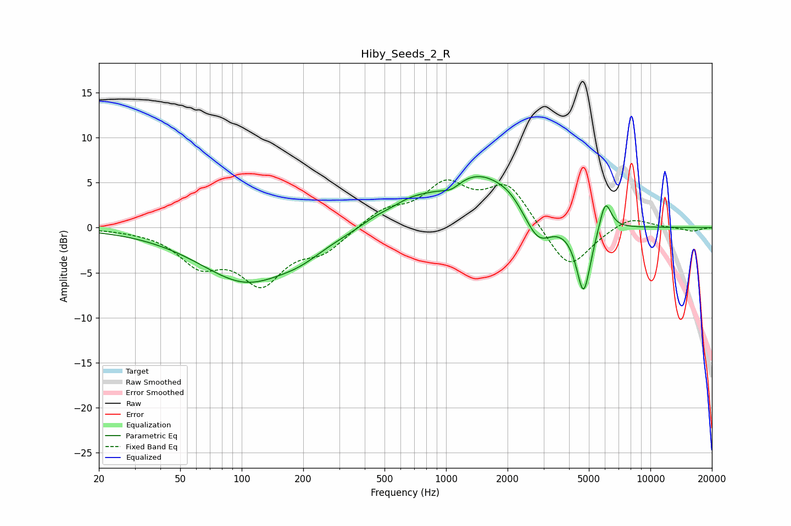

# Hiby_Seeds_2_R
See [usage instructions](https://github.com/jaakkopasanen/AutoEq#usage) for more options and info.

### Parametric EQs
Apply preamp of -5.8 dB when using parametric equalizer.

|   # | Type    |   Fc (Hz) |    Q |   Gain (dB) |
|-----|---------|-----------|------|-------------|
|   1 | Peaking |       105 | 0.61 |        -5.9 |
|   2 | Peaking |       195 | 1.32 |        -1   |
|   3 | Peaking |       446 | 2.04 |         0.5 |
|   4 | Peaking |       660 | 1.32 |         1.5 |
|   5 | Peaking |      1062 | 3.1  |        -0.8 |
|   6 | Peaking |      1431 | 0.75 |         5.9 |
|   7 | Peaking |      2042 | 2.16 |         0.7 |
|   8 | Peaking |      2816 | 2.08 |        -3.5 |
|   9 | Peaking |      4711 | 3.89 |        -7.8 |
|  10 | Peaking |      6014 | 4.75 |         3.5 |

### Fixed Band EQs
When using fixed band (also called graphic) equalizer, apply preamp of **-5.4 dB** (if available) and set gains manually with these parameters.

|   # | Type    |   Fc (Hz) |    Q |   Gain (dB) |
|-----|---------|-----------|------|-------------|
|   1 | Peaking |        31 | 1.41 |        -0.1 |
|   2 | Peaking |        62 | 1.41 |        -3.6 |
|   3 | Peaking |       125 | 1.41 |        -5.7 |
|   4 | Peaking |       250 | 1.41 |        -2.3 |
|   5 | Peaking |       500 | 1.41 |         1.8 |
|   6 | Peaking |      1000 | 1.41 |         4.4 |
|   7 | Peaking |      2000 | 1.41 |         4.6 |
|   8 | Peaking |      4000 | 1.41 |        -4.9 |
|   9 | Peaking |      8000 | 1.41 |         1.3 |
|  10 | Peaking |     16000 | 1.41 |        -0.4 |

### Graphs

