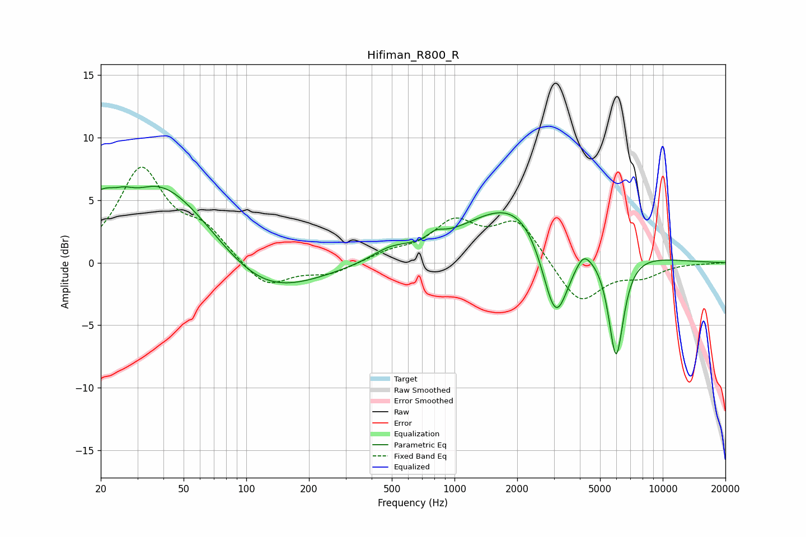

# Hifiman_R800_R
See [usage instructions](https://github.com/jaakkopasanen/AutoEq#usage) for more options and info.

### Parametric EQs
Apply preamp of -6.2 dB when using parametric equalizer.

|   # | Type    |   Fc (Hz) |    Q |   Gain (dB) |
|-----|---------|-----------|------|-------------|
|   1 | Peaking |        24 | 5.73 |        -0.2 |
|   2 | Peaking |        30 | 1.95 |        -1.1 |
|   3 | Peaking |        34 | 0.41 |         8.1 |
|   4 | Peaking |       113 | 0.56 |        -4.3 |
|   5 | Peaking |       490 | 1.58 |         0.8 |
|   6 | Peaking |       813 | 3.71 |         0.6 |
|   7 | Peaking |      2303 | 0.54 |         6.1 |
|   8 | Peaking |      3058 | 1.91 |        -8.8 |
|   9 | Peaking |      4160 | 4.5  |         0.8 |
|  10 | Peaking |      5969 | 3.67 |        -8.7 |

### Fixed Band EQs
When using fixed band (also called graphic) equalizer, apply preamp of **-7.7 dB** (if available) and set gains manually with these parameters.

|   # | Type    |   Fc (Hz) |    Q |   Gain (dB) |
|-----|---------|-----------|------|-------------|
|   1 | Peaking |        31 | 1.41 |         7.3 |
|   2 | Peaking |        62 | 1.41 |         2.3 |
|   3 | Peaking |       125 | 1.41 |        -2.1 |
|   4 | Peaking |       250 | 1.41 |        -0.9 |
|   5 | Peaking |       500 | 1.41 |         0.7 |
|   6 | Peaking |      1000 | 1.41 |         3   |
|   7 | Peaking |      2000 | 1.41 |         3.3 |
|   8 | Peaking |      4000 | 1.41 |        -3.4 |
|   9 | Peaking |      8000 | 1.41 |        -1   |
|  10 | Peaking |     16000 | 1.41 |        -0   |

### Graphs

