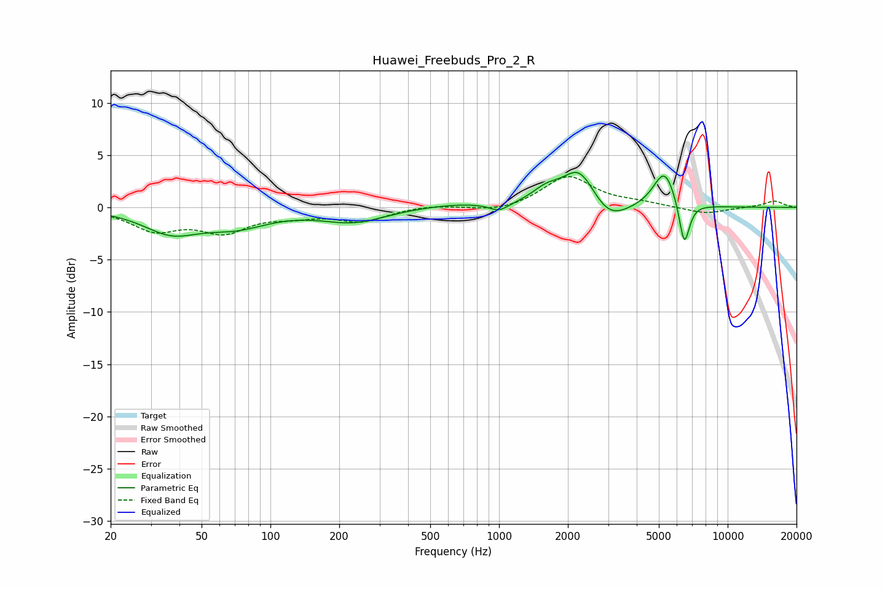

# Huawei_Freebuds_Pro_2_R
See [usage instructions](https://github.com/jaakkopasanen/AutoEq#usage) for more options and info.

### Parametric EQs
Apply preamp of -3.4 dB when using parametric equalizer.

|   # | Type    |   Fc (Hz) |    Q |   Gain (dB) |
|-----|---------|-----------|------|-------------|
|   1 | Peaking |        37 | 1.17 |        -2.1 |
|   2 | Peaking |        71 | 0.99 |        -1.5 |
|   3 | Peaking |       232 | 1    |        -1.3 |
|   4 | Peaking |       662 | 0.76 |         0.4 |
|   5 | Peaking |      1000 | 3.18 |        -0.8 |
|   6 | Peaking |      1611 | 2.26 |         1.2 |
|   7 | Peaking |      2248 | 1.93 |         3.8 |
|   8 | Peaking |      2998 | 1.69 |        -2.1 |
|   9 | Peaking |      5296 | 2.85 |         3.6 |
|  10 | Peaking |      6460 | 5.97 |        -4.4 |

### Fixed Band EQs
When using fixed band (also called graphic) equalizer, apply preamp of **-3.0 dB** (if available) and set gains manually with these parameters.

|   # | Type    |   Fc (Hz) |    Q |   Gain (dB) |
|-----|---------|-----------|------|-------------|
|   1 | Peaking |        31 | 1.41 |        -2   |
|   2 | Peaking |        62 | 1.41 |        -2.1 |
|   3 | Peaking |       125 | 1.41 |        -0.6 |
|   4 | Peaking |       250 | 1.41 |        -1.3 |
|   5 | Peaking |       500 | 1.41 |         0.3 |
|   6 | Peaking |      1000 | 1.41 |        -0.5 |
|   7 | Peaking |      2000 | 1.41 |         3   |
|   8 | Peaking |      4000 | 1.41 |         0.4 |
|   9 | Peaking |      8000 | 1.41 |        -0.6 |
|  10 | Peaking |     16000 | 1.41 |         0.6 |

### Graphs

