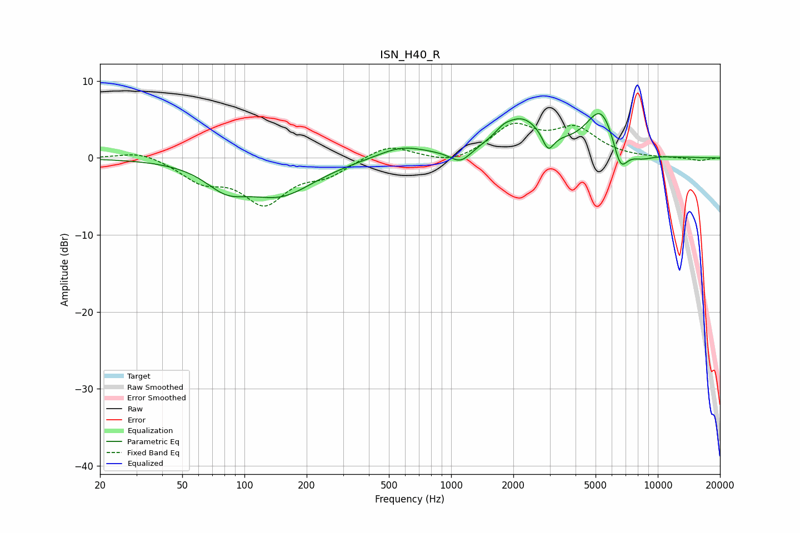

# ISN_H40_R
See [usage instructions](https://github.com/jaakkopasanen/AutoEq#usage) for more options and info.

### Parametric EQs
Apply preamp of -5.8 dB when using parametric equalizer.

|   # | Type    |   Fc (Hz) |    Q |   Gain (dB) |
|-----|---------|-----------|------|-------------|
|   1 | Peaking |        82 | 1.4  |        -2.8 |
|   2 | Peaking |       150 | 0.85 |        -4.5 |
|   3 | Peaking |       576 | 1.19 |         1.6 |
|   4 | Peaking |      1112 | 2.79 |        -1.7 |
|   5 | Peaking |      1791 | 4.27 |         0.5 |
|   6 | Peaking |      2183 | 1.28 |         4.9 |
|   7 | Peaking |      2947 | 5.12 |        -2.5 |
|   8 | Peaking |      5330 | 1.89 |         6.1 |
|   9 | Peaking |      6589 | 3.77 |        -3.9 |
|  10 | Peaking |      8280 | 2.2  |        -0.8 |

### Fixed Band EQs
When using fixed band (also called graphic) equalizer, apply preamp of **-4.6 dB** (if available) and set gains manually with these parameters.

|   # | Type    |   Fc (Hz) |    Q |   Gain (dB) |
|-----|---------|-----------|------|-------------|
|   1 | Peaking |        31 | 1.41 |         1   |
|   2 | Peaking |        62 | 1.41 |        -2.7 |
|   3 | Peaking |       125 | 1.41 |        -5.5 |
|   4 | Peaking |       250 | 1.41 |        -1.9 |
|   5 | Peaking |       500 | 1.41 |         1.8 |
|   6 | Peaking |      1000 | 1.41 |        -1   |
|   7 | Peaking |      2000 | 1.41 |         4   |
|   8 | Peaking |      4000 | 1.41 |         3.5 |
|   9 | Peaking |      8000 | 1.41 |        -0.1 |
|  10 | Peaking |     16000 | 1.41 |        -0.4 |

### Graphs

