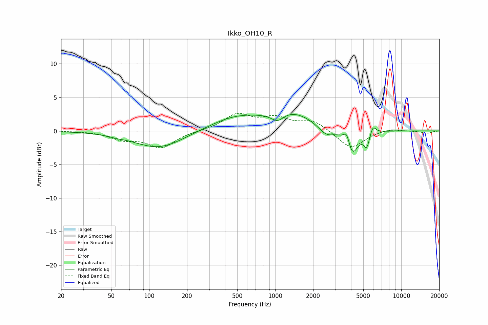

# Ikko_OH10_R
See [usage instructions](https://github.com/jaakkopasanen/AutoEq#usage) for more options and info.

### Parametric EQs
Apply preamp of -2.5 dB when using parametric equalizer.

|   # | Type    |   Fc (Hz) |    Q |   Gain (dB) |
|-----|---------|-----------|------|-------------|
|   1 | Peaking |        55 | 2.92 |        -0.2 |
|   2 | Peaking |       120 | 0.72 |        -2.6 |
|   3 | Peaking |       486 | 0.67 |         2   |
|   4 | Peaking |      1042 | 2.79 |        -1.4 |
|   5 | Peaking |      1350 | 0.76 |         2.6 |
|   6 | Peaking |      2540 | 2.19 |        -1.5 |
|   7 | Peaking |      3703 | 5.92 |         2   |
|   8 | Peaking |      4062 | 3.03 |        -3.9 |
|   9 | Peaking |      5325 | 6    |        -2.2 |
|  10 | Peaking |      5951 | 6    |         1.4 |

### Fixed Band EQs
When using fixed band (also called graphic) equalizer, apply preamp of **-2.7 dB** (if available) and set gains manually with these parameters.

|   # | Type    |   Fc (Hz) |    Q |   Gain (dB) |
|-----|---------|-----------|------|-------------|
|   1 | Peaking |        31 | 1.41 |         0   |
|   2 | Peaking |        62 | 1.41 |        -1.1 |
|   3 | Peaking |       125 | 1.41 |        -2.4 |
|   4 | Peaking |       250 | 1.41 |        -0   |
|   5 | Peaking |       500 | 1.41 |         2.4 |
|   6 | Peaking |      1000 | 1.41 |         1.7 |
|   7 | Peaking |      2000 | 1.41 |         1.5 |
|   8 | Peaking |      4000 | 1.41 |        -2.7 |
|   9 | Peaking |      8000 | 1.41 |         0.4 |
|  10 | Peaking |     16000 | 1.41 |        -0.3 |

### Graphs

