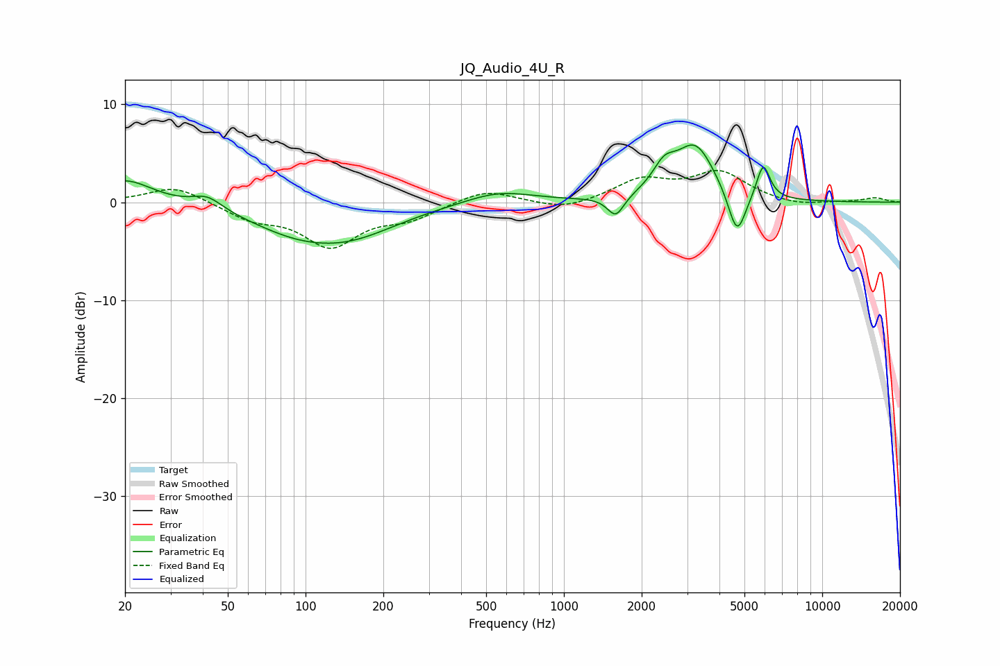

# JQ_Audio_4U_R
See [usage instructions](https://github.com/jaakkopasanen/AutoEq#usage) for more options and info.

### Parametric EQs
Apply preamp of -5.9 dB when using parametric equalizer.

|   # | Type    |   Fc (Hz) |    Q |   Gain (dB) |
|-----|---------|-----------|------|-------------|
|   1 | Peaking |        20 | 1.32 |         2.4 |
|   2 | Peaking |        42 | 2.45 |         1.3 |
|   3 | Peaking |        93 | 0.74 |        -2.3 |
|   4 | Peaking |       151 | 0.75 |        -2.6 |
|   5 | Peaking |       559 | 1.07 |         1.3 |
|   6 | Peaking |      1588 | 4.37 |        -2.1 |
|   7 | Peaking |      2444 | 3.15 |         2.3 |
|   8 | Peaking |      3229 | 1.82 |         5.6 |
|   9 | Peaking |      4677 | 4.04 |        -4.8 |
|  10 | Peaking |      5909 | 5.3  |         3.6 |

### Fixed Band EQs
When using fixed band (also called graphic) equalizer, apply preamp of **-3.3 dB** (if available) and set gains manually with these parameters.

|   # | Type    |   Fc (Hz) |    Q |   Gain (dB) |
|-----|---------|-----------|------|-------------|
|   1 | Peaking |        31 | 1.41 |         1.7 |
|   2 | Peaking |        62 | 1.41 |        -1.5 |
|   3 | Peaking |       125 | 1.41 |        -4.3 |
|   4 | Peaking |       250 | 1.41 |        -1.5 |
|   5 | Peaking |       500 | 1.41 |         1.4 |
|   6 | Peaking |      1000 | 1.41 |        -0.9 |
|   7 | Peaking |      2000 | 1.41 |         2.2 |
|   8 | Peaking |      4000 | 1.41 |         2.9 |
|   9 | Peaking |      8000 | 1.41 |        -0.4 |
|  10 | Peaking |     16000 | 1.41 |         0.4 |

### Graphs

