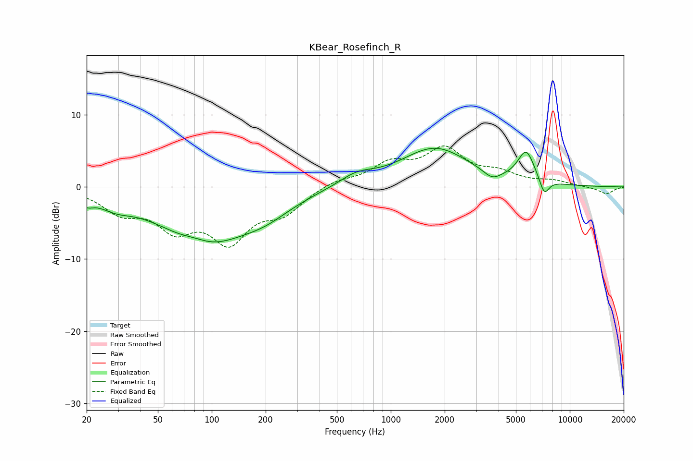

# KBear_Rosefinch_R
See [usage instructions](https://github.com/jaakkopasanen/AutoEq#usage) for more options and info.

### Parametric EQs
Apply preamp of -5.4 dB when using parametric equalizer.

|   # | Type    |   Fc (Hz) |    Q |   Gain (dB) |
|-----|---------|-----------|------|-------------|
|   1 | Peaking |        20 | 3.97 |        -1.1 |
|   2 | Peaking |        29 | 1.54 |        -1.4 |
|   3 | Peaking |        81 | 1.91 |         0.7 |
|   4 | Peaking |        92 | 0.55 |        -7.6 |
|   5 | Peaking |       200 | 1.02 |        -1.7 |
|   6 | Peaking |       642 | 1.46 |         1.4 |
|   7 | Peaking |      1763 | 0.74 |         5.3 |
|   8 | Peaking |      3684 | 2.91 |        -1.2 |
|   9 | Peaking |      5705 | 2.9  |         4.3 |
|  10 | Peaking |      7201 | 5.02 |        -2.3 |

### Fixed Band EQs
When using fixed band (also called graphic) equalizer, apply preamp of **-5.8 dB** (if available) and set gains manually with these parameters.

|   # | Type    |   Fc (Hz) |    Q |   Gain (dB) |
|-----|---------|-----------|------|-------------|
|   1 | Peaking |        31 | 1.41 |        -3.1 |
|   2 | Peaking |        62 | 1.41 |        -5   |
|   3 | Peaking |       125 | 1.41 |        -6.8 |
|   4 | Peaking |       250 | 1.41 |        -3.1 |
|   5 | Peaking |       500 | 1.41 |         0.9 |
|   6 | Peaking |      1000 | 1.41 |         2.9 |
|   7 | Peaking |      2000 | 1.41 |         4.9 |
|   8 | Peaking |      4000 | 1.41 |         1.6 |
|   9 | Peaking |      8000 | 1.41 |         0.7 |
|  10 | Peaking |     16000 | 1.41 |        -1   |

### Graphs

