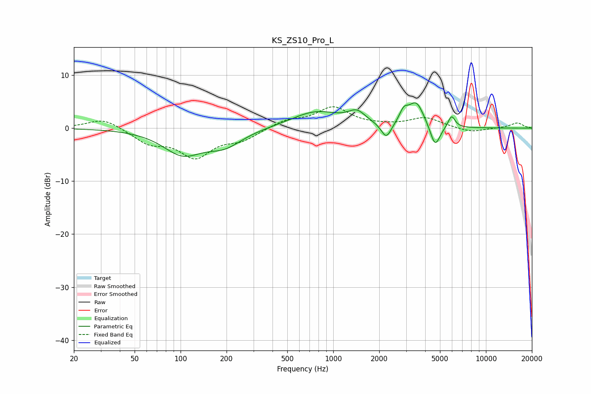

# KS_ZS10_Pro_L
See [usage instructions](https://github.com/jaakkopasanen/AutoEq#usage) for more options and info.

### Parametric EQs
Apply preamp of -4.9 dB when using parametric equalizer.

|   # | Type    |   Fc (Hz) |    Q |   Gain (dB) |
|-----|---------|-----------|------|-------------|
|   1 | Peaking |       103 | 1.1  |        -4.6 |
|   2 | Peaking |       194 | 1.2  |        -2.8 |
|   3 | Peaking |       771 | 0.88 |         3.1 |
|   4 | Peaking |      1428 | 2.5  |         2.2 |
|   5 | Peaking |      2221 | 4.39 |        -2.5 |
|   6 | Peaking |      2258 | 3.51 |        -0.5 |
|   7 | Peaking |      2895 | 4.95 |         2.1 |
|   8 | Peaking |      3494 | 2.75 |         4.7 |
|   9 | Peaking |      4648 | 4.3  |        -4.3 |
|  10 | Peaking |      5957 | 6    |         2.3 |

### Fixed Band EQs
When using fixed band (also called graphic) equalizer, apply preamp of **-4.1 dB** (if available) and set gains manually with these parameters.

|   # | Type    |   Fc (Hz) |    Q |   Gain (dB) |
|-----|---------|-----------|------|-------------|
|   1 | Peaking |        31 | 1.41 |         2   |
|   2 | Peaking |        62 | 1.41 |        -2.6 |
|   3 | Peaking |       125 | 1.41 |        -5.1 |
|   4 | Peaking |       250 | 1.41 |        -1.9 |
|   5 | Peaking |       500 | 1.41 |         1.4 |
|   6 | Peaking |      1000 | 1.41 |         3.8 |
|   7 | Peaking |      2000 | 1.41 |         0.3 |
|   8 | Peaking |      4000 | 1.41 |         1.9 |
|   9 | Peaking |      8000 | 1.41 |        -0.8 |
|  10 | Peaking |     16000 | 1.41 |         1   |

### Graphs

