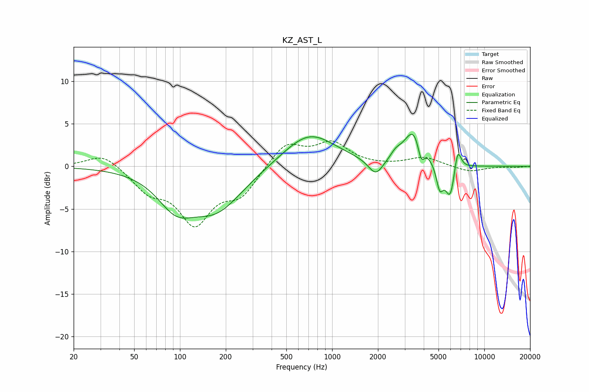

# KZ_AST_L
See [usage instructions](https://github.com/jaakkopasanen/AutoEq#usage) for more options and info.

### Parametric EQs
Apply preamp of -3.9 dB when using parametric equalizer.

|   # | Type    |   Fc (Hz) |    Q |   Gain (dB) |
|-----|---------|-----------|------|-------------|
|   1 | Peaking |        94 | 1.19 |        -3.7 |
|   2 | Peaking |       174 | 0.8  |        -4.8 |
|   3 | Peaking |       708 | 0.82 |         4   |
|   4 | Peaking |      1936 | 2.89 |        -2   |
|   5 | Peaking |      2616 | 4.25 |         0.7 |
|   6 | Peaking |      3479 | 2.15 |         4.5 |
|   7 | Peaking |      3839 | 6    |        -2.6 |
|   8 | Peaking |      5094 | 5.99 |        -2.8 |
|   9 | Peaking |      5980 | 4.17 |        -4.2 |
|  10 | Peaking |      6674 | 5.88 |         3.1 |

### Fixed Band EQs
When using fixed band (also called graphic) equalizer, apply preamp of **-3.1 dB** (if available) and set gains manually with these parameters.

|   # | Type    |   Fc (Hz) |    Q |   Gain (dB) |
|-----|---------|-----------|------|-------------|
|   1 | Peaking |        31 | 1.41 |         1.6 |
|   2 | Peaking |        62 | 1.41 |        -2.5 |
|   3 | Peaking |       125 | 1.41 |        -6.3 |
|   4 | Peaking |       250 | 1.41 |        -3.1 |
|   5 | Peaking |       500 | 1.41 |         2.8 |
|   6 | Peaking |      1000 | 1.41 |         2.6 |
|   7 | Peaking |      2000 | 1.41 |        -0   |
|   8 | Peaking |      4000 | 1.41 |         1.1 |
|   9 | Peaking |      8000 | 1.41 |        -0.7 |
|  10 | Peaking |     16000 | 1.41 |        -0.1 |

### Graphs

