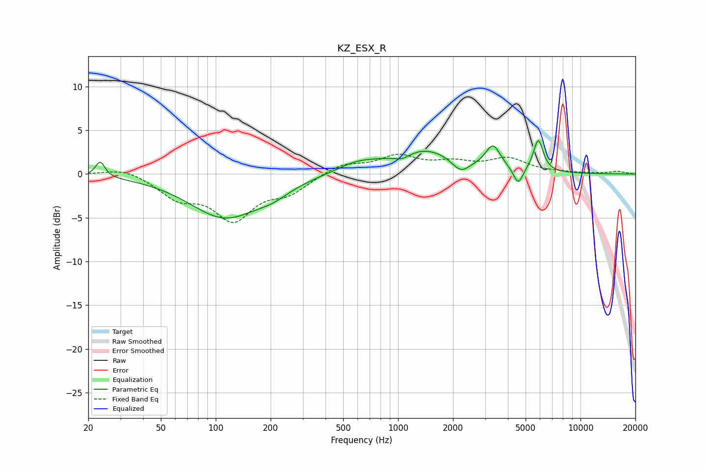

# KZ_ESX_R
See [usage instructions](https://github.com/jaakkopasanen/AutoEq#usage) for more options and info.

### Parametric EQs
Apply preamp of -3.9 dB when using parametric equalizer.

|   # | Type    |   Fc (Hz) |    Q |   Gain (dB) |
|-----|---------|-----------|------|-------------|
|   1 | Peaking |        23 | 5.63 |         1.8 |
|   2 | Peaking |       112 | 0.72 |        -4.9 |
|   3 | Peaking |       207 | 1.58 |        -0.9 |
|   4 | Peaking |       595 | 1.25 |         1   |
|   5 | Peaking |      1051 | 3.07 |        -0.7 |
|   6 | Peaking |      1393 | 0.78 |         2.8 |
|   7 | Peaking |      2202 | 2.86 |        -1.5 |
|   8 | Peaking |      3314 | 3.46 |         2.7 |
|   9 | Peaking |      4553 | 5.44 |        -2   |
|  10 | Peaking |      5871 | 5.19 |         3.7 |

### Fixed Band EQs
When using fixed band (also called graphic) equalizer, apply preamp of **-2.4 dB** (if available) and set gains manually with these parameters.

|   # | Type    |   Fc (Hz) |    Q |   Gain (dB) |
|-----|---------|-----------|------|-------------|
|   1 | Peaking |        31 | 1.41 |         0.8 |
|   2 | Peaking |        62 | 1.41 |        -2.4 |
|   3 | Peaking |       125 | 1.41 |        -4.9 |
|   4 | Peaking |       250 | 1.41 |        -1.9 |
|   5 | Peaking |       500 | 1.41 |         1.2 |
|   6 | Peaking |      1000 | 1.41 |         1.9 |
|   7 | Peaking |      2000 | 1.41 |         1.1 |
|   8 | Peaking |      4000 | 1.41 |         1.6 |
|   9 | Peaking |      8000 | 1.41 |         0.1 |
|  10 | Peaking |     16000 | 1.41 |         0.3 |

### Graphs

