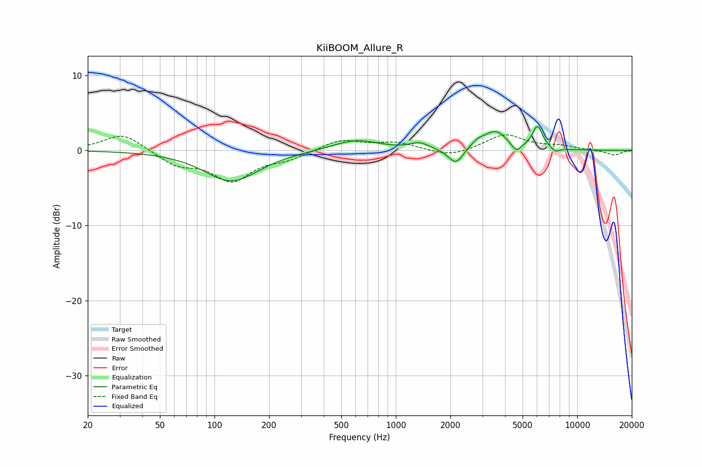

# KiiBOOM_Allure_R
See [usage instructions](https://github.com/jaakkopasanen/AutoEq#usage) for more options and info.

### Parametric EQs
Apply preamp of -3.3 dB when using parametric equalizer.

|   # | Type    |   Fc (Hz) |    Q |   Gain (dB) |
|-----|---------|-----------|------|-------------|
|   1 | Peaking |       124 | 0.95 |        -4.1 |
|   2 | Peaking |       600 | 1.12 |         1.4 |
|   3 | Peaking |      1353 | 2.82 |         0.8 |
|   4 | Peaking |      2022 | 3.05 |        -0.4 |
|   5 | Peaking |      2156 | 3.75 |        -1.8 |
|   6 | Peaking |      2832 | 3.71 |         0.8 |
|   7 | Peaking |      3548 | 2.29 |         2.4 |
|   8 | Peaking |      4609 | 5.67 |        -1.1 |
|   9 | Peaking |      6041 | 4.81 |         3   |
|  10 | Peaking |      7577 | 5.8  |        -0.6 |

### Fixed Band EQs
When using fixed band (also called graphic) equalizer, apply preamp of **-2.2 dB** (if available) and set gains manually with these parameters.

|   # | Type    |   Fc (Hz) |    Q |   Gain (dB) |
|-----|---------|-----------|------|-------------|
|   1 | Peaking |        31 | 1.41 |         2.3 |
|   2 | Peaking |        62 | 1.41 |        -1.8 |
|   3 | Peaking |       125 | 1.41 |        -3.8 |
|   4 | Peaking |       250 | 1.41 |        -1   |
|   5 | Peaking |       500 | 1.41 |         1.4 |
|   6 | Peaking |      1000 | 1.41 |         1   |
|   7 | Peaking |      2000 | 1.41 |        -0.9 |
|   8 | Peaking |      4000 | 1.41 |         2.1 |
|   9 | Peaking |      8000 | 1.41 |         0.5 |
|  10 | Peaking |     16000 | 1.41 |        -0.7 |

### Graphs

