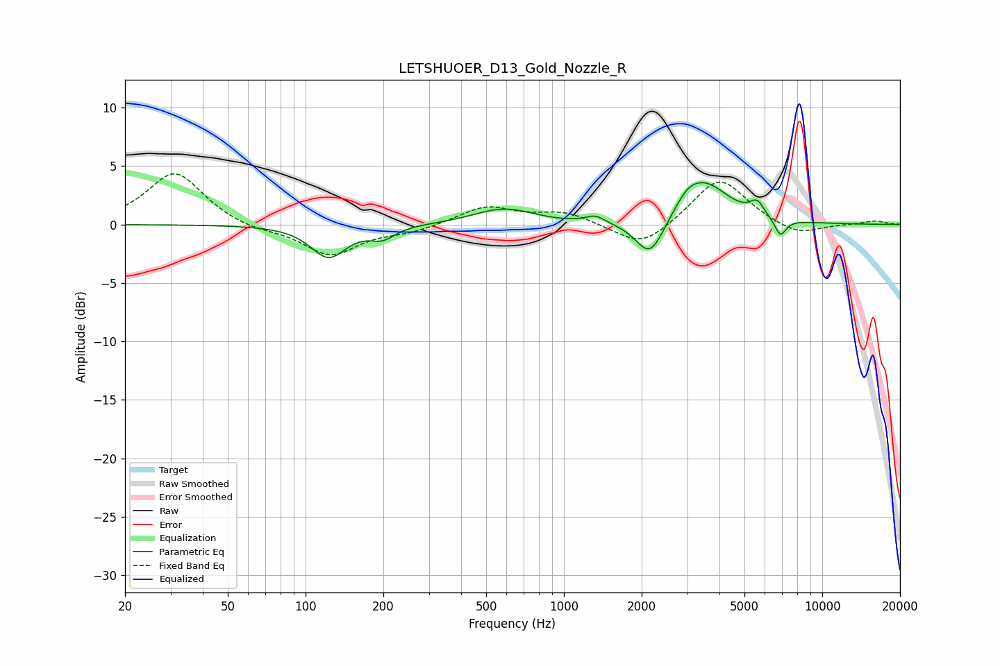

# LETSHUOER_D13_Gold_Nozzle_R
See [usage instructions](https://github.com/jaakkopasanen/AutoEq#usage) for more options and info.

### Parametric EQs
Apply preamp of -3.7 dB when using parametric equalizer.

|   # | Type    |   Fc (Hz) |    Q |   Gain (dB) |
|-----|---------|-----------|------|-------------|
|   1 | Peaking |       123 | 2.07 |        -2.8 |
|   2 | Peaking |       198 | 2.92 |        -1   |
|   3 | Peaking |       570 | 1.28 |         1.2 |
|   4 | Peaking |       711 | 1.9  |         0.2 |
|   5 | Peaking |      1323 | 3.91 |         0.6 |
|   6 | Peaking |      2156 | 2.53 |        -3.4 |
|   7 | Peaking |      3003 | 3.45 |         0.7 |
|   8 | Peaking |      3455 | 1.43 |         3.7 |
|   9 | Peaking |      5593 | 5.04 |         1.2 |
|  10 | Peaking |      6886 | 5.98 |        -1.5 |

### Fixed Band EQs
When using fixed band (also called graphic) equalizer, apply preamp of **-4.4 dB** (if available) and set gains manually with these parameters.

|   # | Type    |   Fc (Hz) |    Q |   Gain (dB) |
|-----|---------|-----------|------|-------------|
|   1 | Peaking |        31 | 1.41 |         4.5 |
|   2 | Peaking |        62 | 1.41 |        -0.5 |
|   3 | Peaking |       125 | 1.41 |        -2.6 |
|   4 | Peaking |       250 | 1.41 |        -0.6 |
|   5 | Peaking |       500 | 1.41 |         1.5 |
|   6 | Peaking |      1000 | 1.41 |         1   |
|   7 | Peaking |      2000 | 1.41 |        -2.1 |
|   8 | Peaking |      4000 | 1.41 |         4.1 |
|   9 | Peaking |      8000 | 1.41 |        -1   |
|  10 | Peaking |     16000 | 1.41 |         0.3 |

### Graphs

