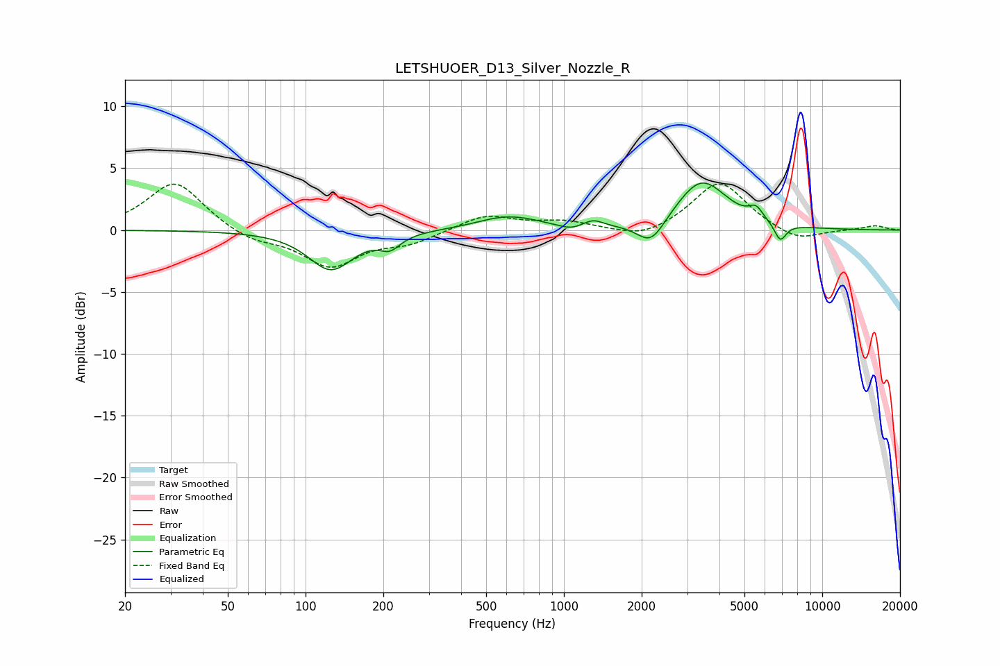

# LETSHUOER_D13_Silver_Nozzle_R
See [usage instructions](https://github.com/jaakkopasanen/AutoEq#usage) for more options and info.

### Parametric EQs
Apply preamp of -3.9 dB when using parametric equalizer.

|   # | Type    |   Fc (Hz) |    Q |   Gain (dB) |
|-----|---------|-----------|------|-------------|
|   1 | Peaking |       125 | 1.63 |        -3.2 |
|   2 | Peaking |       212 | 3.53 |        -1   |
|   3 | Peaking |       592 | 1.25 |         1   |
|   4 | Peaking |       729 | 2.2  |         0.1 |
|   5 | Peaking |      1063 | 3.43 |        -0.4 |
|   6 | Peaking |      1300 | 3.68 |         0.6 |
|   7 | Peaking |      2175 | 2.61 |        -2.1 |
|   8 | Peaking |      3412 | 1.43 |         4   |
|   9 | Peaking |      5544 | 4.98 |         1   |
|  10 | Peaking |      6880 | 5.97 |        -1.5 |

### Fixed Band EQs
When using fixed band (also called graphic) equalizer, apply preamp of **-3.8 dB** (if available) and set gains manually with these parameters.

|   # | Type    |   Fc (Hz) |    Q |   Gain (dB) |
|-----|---------|-----------|------|-------------|
|   1 | Peaking |        31 | 1.41 |         4   |
|   2 | Peaking |        62 | 1.41 |        -0.9 |
|   3 | Peaking |       125 | 1.41 |        -2.9 |
|   4 | Peaking |       250 | 1.41 |        -0.9 |
|   5 | Peaking |       500 | 1.41 |         1.2 |
|   6 | Peaking |      1000 | 1.41 |         0.6 |
|   7 | Peaking |      2000 | 1.41 |        -0.8 |
|   8 | Peaking |      4000 | 1.41 |         4   |
|   9 | Peaking |      8000 | 1.41 |        -1   |
|  10 | Peaking |     16000 | 1.41 |         0.4 |

### Graphs

