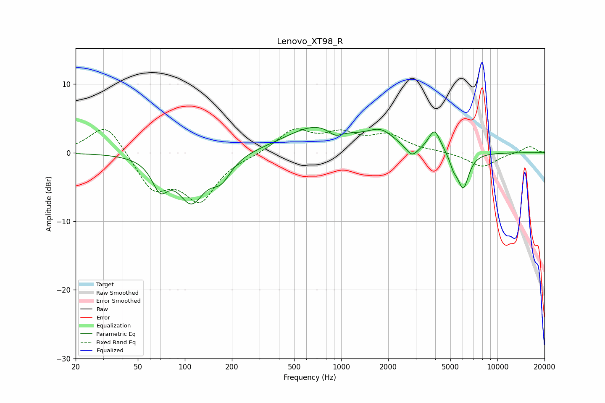

# Lenovo_XT98_R
See [usage instructions](https://github.com/jaakkopasanen/AutoEq#usage) for more options and info.

### Parametric EQs
Apply preamp of -3.8 dB when using parametric equalizer.

|   # | Type    |   Fc (Hz) |    Q |   Gain (dB) |
|-----|---------|-----------|------|-------------|
|   1 | Peaking |        69 | 2.77 |        -3.9 |
|   2 | Peaking |       110 | 1.66 |        -6.6 |
|   3 | Peaking |       171 | 2.21 |        -2.9 |
|   4 | Peaking |       713 | 0.69 |         3.9 |
|   5 | Peaking |       915 | 3.02 |        -1.2 |
|   6 | Peaking |      1797 | 1.61 |         2.3 |
|   7 | Peaking |      2839 | 3.69 |        -1.6 |
|   8 | Peaking |      3958 | 3.7  |         3.2 |
|   9 | Peaking |      5237 | 5.97 |        -1.4 |
|  10 | Peaking |      6036 | 3.8  |        -5.2 |

### Fixed Band EQs
When using fixed band (also called graphic) equalizer, apply preamp of **-3.6 dB** (if available) and set gains manually with these parameters.

|   # | Type    |   Fc (Hz) |    Q |   Gain (dB) |
|-----|---------|-----------|------|-------------|
|   1 | Peaking |        31 | 1.41 |         4.5 |
|   2 | Peaking |        62 | 1.41 |        -5.1 |
|   3 | Peaking |       125 | 1.41 |        -6.6 |
|   4 | Peaking |       250 | 1.41 |        -0.3 |
|   5 | Peaking |       500 | 1.41 |         3.2 |
|   6 | Peaking |      1000 | 1.41 |         2.4 |
|   7 | Peaking |      2000 | 1.41 |         2.3 |
|   8 | Peaking |      4000 | 1.41 |         0.1 |
|   9 | Peaking |      8000 | 1.41 |        -2.1 |
|  10 | Peaking |     16000 | 1.41 |         1   |

### Graphs

