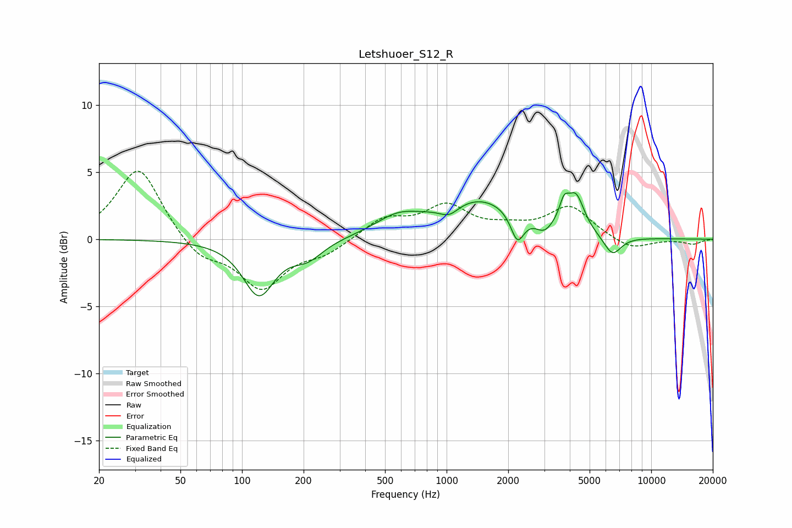

# Letshuoer_S12_R
See [usage instructions](https://github.com/jaakkopasanen/AutoEq#usage) for more options and info.

### Parametric EQs
Apply preamp of -3.6 dB when using parametric equalizer.

|   # | Type    |   Fc (Hz) |    Q |   Gain (dB) |
|-----|---------|-----------|------|-------------|
|   1 | Peaking |       121 | 1.85 |        -4.1 |
|   2 | Peaking |       209 | 1.83 |        -1.2 |
|   3 | Peaking |       576 | 1.27 |         1.3 |
|   4 | Peaking |      1031 | 3.02 |        -0.8 |
|   5 | Peaking |      1459 | 0.71 |         2.9 |
|   6 | Peaking |      2219 | 4.36 |        -2.1 |
|   7 | Peaking |      2994 | 3.59 |        -0.8 |
|   8 | Peaking |      3750 | 6    |         1.5 |
|   9 | Peaking |      4286 | 3.41 |         2.7 |
|  10 | Peaking |      6463 | 3.15 |        -1.5 |

### Fixed Band EQs
When using fixed band (also called graphic) equalizer, apply preamp of **-5.2 dB** (if available) and set gains manually with these parameters.

|   # | Type    |   Fc (Hz) |    Q |   Gain (dB) |
|-----|---------|-----------|------|-------------|
|   1 | Peaking |        31 | 1.41 |         5.5 |
|   2 | Peaking |        62 | 1.41 |        -1.5 |
|   3 | Peaking |       125 | 1.41 |        -3.6 |
|   4 | Peaking |       250 | 1.41 |        -1   |
|   5 | Peaking |       500 | 1.41 |         1.5 |
|   6 | Peaking |      1000 | 1.41 |         2.3 |
|   7 | Peaking |      2000 | 1.41 |         0.6 |
|   8 | Peaking |      4000 | 1.41 |         2.4 |
|   9 | Peaking |      8000 | 1.41 |        -0.8 |
|  10 | Peaking |     16000 | 1.41 |        -0.4 |

### Graphs

