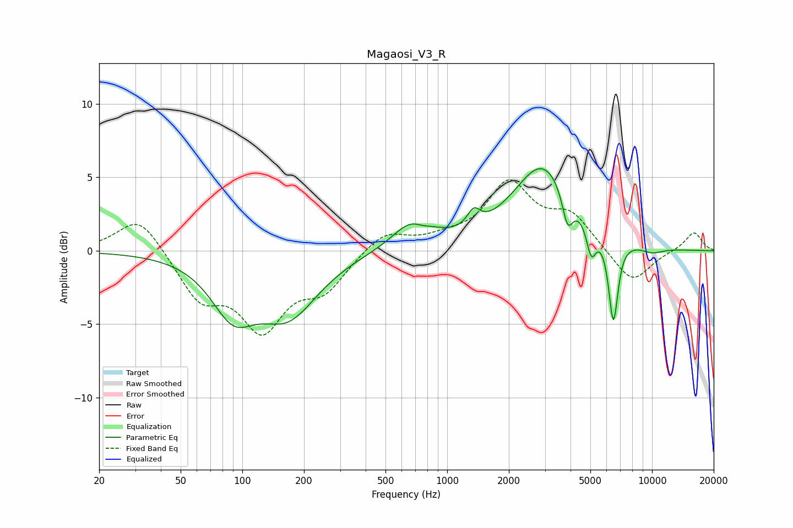

# Magaosi_V3_R
See [usage instructions](https://github.com/jaakkopasanen/AutoEq#usage) for more options and info.

### Parametric EQs
Apply preamp of -5.7 dB when using parametric equalizer.

|   # | Type    |   Fc (Hz) |    Q |   Gain (dB) |
|-----|---------|-----------|------|-------------|
|   1 | Peaking |        90 | 1.33 |        -3.6 |
|   2 | Peaking |       167 | 0.96 |        -4   |
|   3 | Peaking |       685 | 1.45 |         2   |
|   4 | Peaking |       750 | 3.32 |        -0.3 |
|   5 | Peaking |      1348 | 4.56 |         1.1 |
|   6 | Peaking |      2939 | 0.96 |         5.8 |
|   7 | Peaking |      3871 | 5.33 |        -2.3 |
|   8 | Peaking |      5051 | 6    |        -2.1 |
|   9 | Peaking |      6476 | 5.94 |        -5.8 |
|  10 | Peaking |     10000 | 2.2  |        -0.4 |

### Fixed Band EQs
When using fixed band (also called graphic) equalizer, apply preamp of **-4.9 dB** (if available) and set gains manually with these parameters.

|   # | Type    |   Fc (Hz) |    Q |   Gain (dB) |
|-----|---------|-----------|------|-------------|
|   1 | Peaking |        31 | 1.41 |         2.5 |
|   2 | Peaking |        62 | 1.41 |        -3.1 |
|   3 | Peaking |       125 | 1.41 |        -4.9 |
|   4 | Peaking |       250 | 1.41 |        -2.3 |
|   5 | Peaking |       500 | 1.41 |         1.4 |
|   6 | Peaking |      1000 | 1.41 |         0.6 |
|   7 | Peaking |      2000 | 1.41 |         4.4 |
|   8 | Peaking |      4000 | 1.41 |         2.2 |
|   9 | Peaking |      8000 | 1.41 |        -2.3 |
|  10 | Peaking |     16000 | 1.41 |         1.3 |

### Graphs

