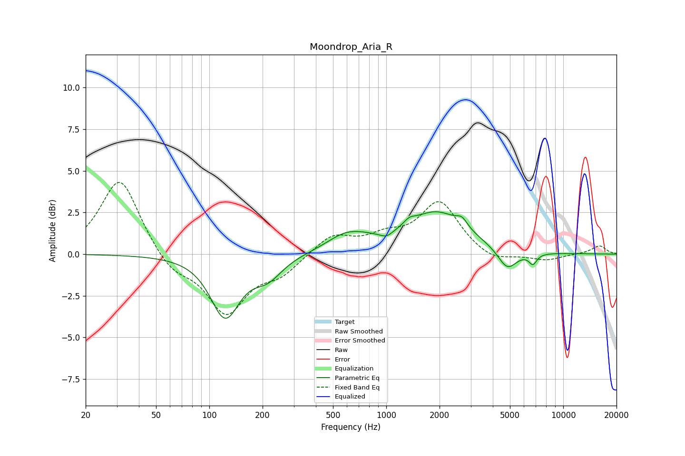

# Moondrop_Aria_R
See [usage instructions](https://github.com/jaakkopasanen/AutoEq#usage) for more options and info.

### Parametric EQs
Apply preamp of -2.6 dB when using parametric equalizer.

|   # | Type    |   Fc (Hz) |    Q |   Gain (dB) |
|-----|---------|-----------|------|-------------|
|   1 | Peaking |       123 | 1.74 |        -3.7 |
|   2 | Peaking |       213 | 1.7  |        -1.2 |
|   3 | Peaking |       596 | 1.25 |         1   |
|   4 | Peaking |       767 | 2.16 |         0.1 |
|   5 | Peaking |      1004 | 4.13 |        -0.3 |
|   6 | Peaking |      1349 | 4.55 |         0.3 |
|   7 | Peaking |      1916 | 0.85 |         2.5 |
|   8 | Peaking |      2676 | 4.71 |         0.5 |
|   9 | Peaking |      4833 | 2.57 |        -1.3 |
|  10 | Peaking |      6738 | 6    |        -0.6 |

### Fixed Band EQs
When using fixed band (also called graphic) equalizer, apply preamp of **-4.4 dB** (if available) and set gains manually with these parameters.

|   # | Type    |   Fc (Hz) |    Q |   Gain (dB) |
|-----|---------|-----------|------|-------------|
|   1 | Peaking |        31 | 1.41 |         4.6 |
|   2 | Peaking |        62 | 1.41 |        -1.1 |
|   3 | Peaking |       125 | 1.41 |        -3.4 |
|   4 | Peaking |       250 | 1.41 |        -1.1 |
|   5 | Peaking |       500 | 1.41 |         1.2 |
|   6 | Peaking |      1000 | 1.41 |         0.9 |
|   7 | Peaking |      2000 | 1.41 |         3.1 |
|   8 | Peaking |      4000 | 1.41 |        -0.6 |
|   9 | Peaking |      8000 | 1.41 |        -0.4 |
|  10 | Peaking |     16000 | 1.41 |         0.5 |

### Graphs

