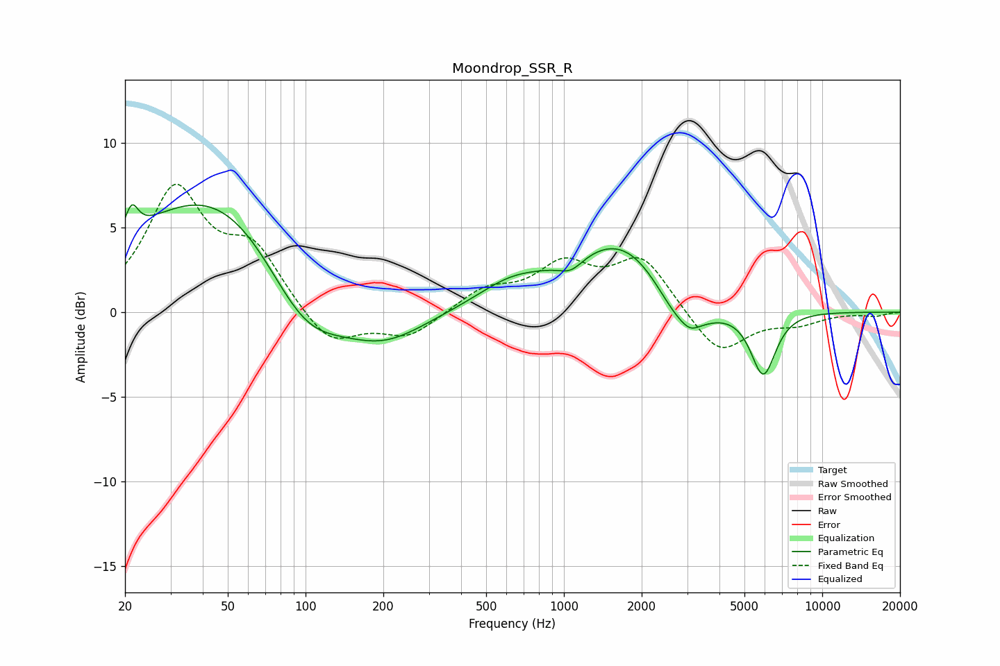

# Moondrop_SSR_R
See [usage instructions](https://github.com/jaakkopasanen/AutoEq#usage) for more options and info.

### Parametric EQs
Apply preamp of -6.4 dB when using parametric equalizer.

|   # | Type    |   Fc (Hz) |    Q |   Gain (dB) |
|-----|---------|-----------|------|-------------|
|   1 | Peaking |        21 | 5.77 |         1.6 |
|   2 | Peaking |        48 | 0.39 |         7.9 |
|   3 | Peaking |        98 | 0.85 |        -5.1 |
|   4 | Peaking |       198 | 0.82 |        -2.5 |
|   5 | Peaking |       619 | 1.08 |         1.2 |
|   6 | Peaking |      1066 | 2.98 |        -0.7 |
|   7 | Peaking |      1751 | 0.66 |         4.8 |
|   8 | Peaking |      2866 | 1.26 |        -3.4 |
|   9 | Peaking |      3087 | 4.53 |        -0.3 |
|  10 | Peaking |      5909 | 2.83 |        -3.9 |

### Fixed Band EQs
When using fixed band (also called graphic) equalizer, apply preamp of **-7.6 dB** (if available) and set gains manually with these parameters.

|   # | Type    |   Fc (Hz) |    Q |   Gain (dB) |
|-----|---------|-----------|------|-------------|
|   1 | Peaking |        31 | 1.41 |         7   |
|   2 | Peaking |        62 | 1.41 |         3.4 |
|   3 | Peaking |       125 | 1.41 |        -2.1 |
|   4 | Peaking |       250 | 1.41 |        -1.5 |
|   5 | Peaking |       500 | 1.41 |         1.3 |
|   6 | Peaking |      1000 | 1.41 |         2.5 |
|   7 | Peaking |      2000 | 1.41 |         3.1 |
|   8 | Peaking |      4000 | 1.41 |        -2.6 |
|   9 | Peaking |      8000 | 1.41 |        -0.6 |
|  10 | Peaking |     16000 | 1.41 |        -0.2 |

### Graphs

