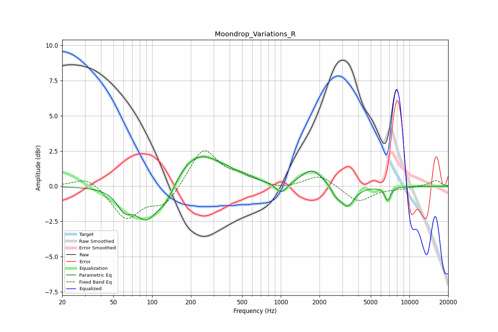

# Moondrop_Variations_R
See [usage instructions](https://github.com/jaakkopasanen/AutoEq#usage) for more options and info.

### Parametric EQs
Apply preamp of -2.2 dB when using parametric equalizer.

|   # | Type    |   Fc (Hz) |    Q |   Gain (dB) |
|-----|---------|-----------|------|-------------|
|   1 | Peaking |        61 | 2.46 |        -1.3 |
|   2 | Peaking |        90 | 1.63 |        -2.3 |
|   3 | Peaking |       129 | 1.96 |        -1.3 |
|   4 | Peaking |       225 | 0.79 |         2.4 |
|   5 | Peaking |       417 | 1.35 |         0.3 |
|   6 | Peaking |      1010 | 3.15 |        -0.8 |
|   7 | Peaking |      1750 | 1.66 |         1.2 |
|   8 | Peaking |      2675 | 4.17 |        -0.5 |
|   9 | Peaking |      3280 | 2.65 |        -1.5 |
|  10 | Peaking |      6771 | 6    |        -1   |

### Fixed Band EQs
When using fixed band (also called graphic) equalizer, apply preamp of **-2.6 dB** (if available) and set gains manually with these parameters.

|   # | Type    |   Fc (Hz) |    Q |   Gain (dB) |
|-----|---------|-----------|------|-------------|
|   1 | Peaking |        31 | 1.41 |         0.8 |
|   2 | Peaking |        62 | 1.41 |        -2.3 |
|   3 | Peaking |       125 | 1.41 |        -1.4 |
|   4 | Peaking |       250 | 1.41 |         2.7 |
|   5 | Peaking |       500 | 1.41 |         0.6 |
|   6 | Peaking |      1000 | 1.41 |        -0.3 |
|   7 | Peaking |      2000 | 1.41 |         0.8 |
|   8 | Peaking |      4000 | 1.41 |        -1.1 |
|   9 | Peaking |      8000 | 1.41 |        -0.1 |
|  10 | Peaking |     16000 | 1.41 |         0.4 |

### Graphs

