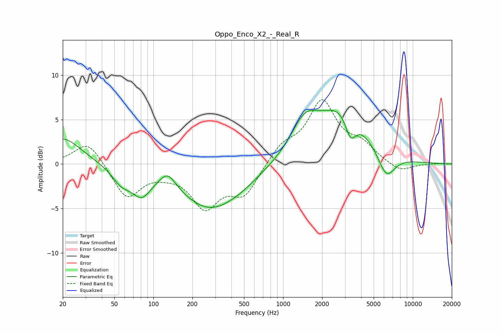

# Oppo_Enco_X2_-_Real_R
See [usage instructions](https://github.com/jaakkopasanen/AutoEq#usage) for more options and info.

### Parametric EQs
Apply preamp of -6.2 dB when using parametric equalizer.

|   # | Type    |   Fc (Hz) |    Q |   Gain (dB) |
|-----|---------|-----------|------|-------------|
|   1 | Peaking |        20 | 1.02 |         3   |
|   2 | Peaking |        56 | 1.93 |        -1.6 |
|   3 | Peaking |        81 | 1.89 |        -2.6 |
|   4 | Peaking |       129 | 2.31 |         1.7 |
|   5 | Peaking |       270 | 0.62 |        -4.8 |
|   6 | Peaking |       478 | 0.95 |        -0.7 |
|   7 | Peaking |      1464 | 1.34 |         3.7 |
|   8 | Peaking |      2884 | 0.78 |         6.1 |
|   9 | Peaking |      3312 | 3.26 |        -2.9 |
|  10 | Peaking |      6259 | 2.05 |        -3   |

### Fixed Band EQs
When using fixed band (also called graphic) equalizer, apply preamp of **-7.3 dB** (if available) and set gains manually with these parameters.

|   # | Type    |   Fc (Hz) |    Q |   Gain (dB) |
|-----|---------|-----------|------|-------------|
|   1 | Peaking |        31 | 1.41 |         2.7 |
|   2 | Peaking |        62 | 1.41 |        -3.8 |
|   3 | Peaking |       125 | 1.41 |        -0.6 |
|   4 | Peaking |       250 | 1.41 |        -4.6 |
|   5 | Peaking |       500 | 1.41 |        -3.3 |
|   6 | Peaking |      1000 | 1.41 |         1.9 |
|   7 | Peaking |      2000 | 1.41 |         6.7 |
|   8 | Peaking |      4000 | 1.41 |         1.8 |
|   9 | Peaking |      8000 | 1.41 |        -1   |
|  10 | Peaking |     16000 | 1.41 |         0.1 |

### Graphs

