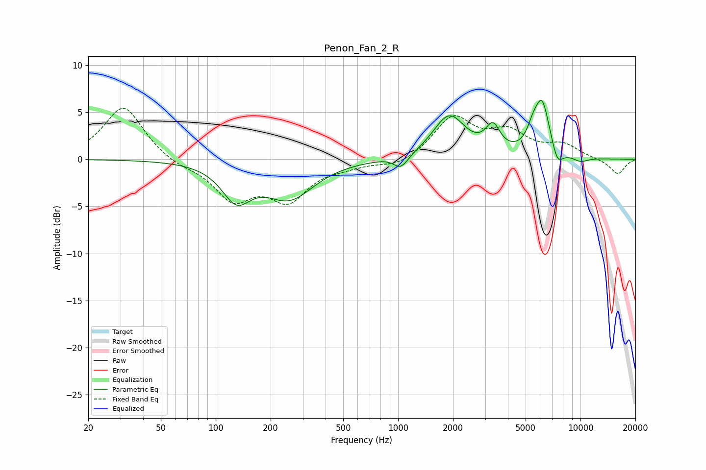

# Penon_Fan_2_R
See [usage instructions](https://github.com/jaakkopasanen/AutoEq#usage) for more options and info.

### Parametric EQs
Apply preamp of -6.3 dB when using parametric equalizer.

|   # | Type    |   Fc (Hz) |    Q |   Gain (dB) |
|-----|---------|-----------|------|-------------|
|   1 | Peaking |       130 | 1.78 |        -3.7 |
|   2 | Peaking |       254 | 1.05 |        -3.9 |
|   3 | Peaking |       931 | 2.96 |         0.2 |
|   4 | Peaking |      1031 | 3.32 |        -1.5 |
|   5 | Peaking |      1906 | 1.6  |         4.6 |
|   6 | Peaking |      3308 | 3.6  |         2.6 |
|   7 | Peaking |      5455 | 4.68 |         1.3 |
|   8 | Peaking |      6152 | 3.21 |         5.8 |
|   9 | Peaking |      7468 | 4.43 |        -1.8 |
|  10 | Peaking |     10000 | 3.01 |        -0.5 |

### Fixed Band EQs
When using fixed band (also called graphic) equalizer, apply preamp of **-5.5 dB** (if available) and set gains manually with these parameters.

|   # | Type    |   Fc (Hz) |    Q |   Gain (dB) |
|-----|---------|-----------|------|-------------|
|   1 | Peaking |        31 | 1.41 |         5.7 |
|   2 | Peaking |        62 | 1.41 |        -0.7 |
|   3 | Peaking |       125 | 1.41 |        -4   |
|   4 | Peaking |       250 | 1.41 |        -4   |
|   5 | Peaking |       500 | 1.41 |        -0.5 |
|   6 | Peaking |      1000 | 1.41 |        -0.9 |
|   7 | Peaking |      2000 | 1.41 |         4.3 |
|   8 | Peaking |      4000 | 1.41 |         2.6 |
|   9 | Peaking |      8000 | 1.41 |         1.4 |
|  10 | Peaking |     16000 | 1.41 |        -1.6 |

### Graphs

