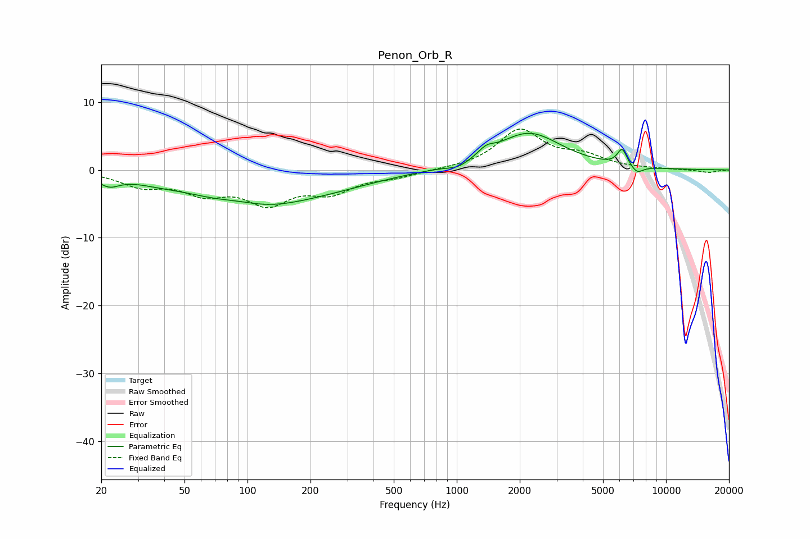

# Penon_Orb_R
See [usage instructions](https://github.com/jaakkopasanen/AutoEq#usage) for more options and info.

### Parametric EQs
Apply preamp of -5.5 dB when using parametric equalizer.

|   # | Type    |   Fc (Hz) |    Q |   Gain (dB) |
|-----|---------|-----------|------|-------------|
|   1 | Peaking |        22 | 2.8  |        -1.5 |
|   2 | Peaking |        36 | 1.3  |        -0.5 |
|   3 | Peaking |        92 | 1.34 |         0.8 |
|   4 | Peaking |       105 | 0.5  |        -5.2 |
|   5 | Peaking |       281 | 0.59 |        -1   |
|   6 | Peaking |      1018 | 2.76 |        -0.8 |
|   7 | Peaking |      1382 | 3.76 |         1   |
|   8 | Peaking |      2208 | 0.9  |         5.4 |
|   9 | Peaking |      6173 | 6    |         2.5 |
|  10 | Peaking |      7267 | 4.56 |        -1.1 |

### Fixed Band EQs
When using fixed band (also called graphic) equalizer, apply preamp of **-6.1 dB** (if available) and set gains manually with these parameters.

|   # | Type    |   Fc (Hz) |    Q |   Gain (dB) |
|-----|---------|-----------|------|-------------|
|   1 | Peaking |        31 | 1.41 |        -2.1 |
|   2 | Peaking |        62 | 1.41 |        -2.9 |
|   3 | Peaking |       125 | 1.41 |        -4.4 |
|   4 | Peaking |       250 | 1.41 |        -2.9 |
|   5 | Peaking |       500 | 1.41 |        -0.9 |
|   6 | Peaking |      1000 | 1.41 |         0.1 |
|   7 | Peaking |      2000 | 1.41 |         5.8 |
|   8 | Peaking |      4000 | 1.41 |         1.8 |
|   9 | Peaking |      8000 | 1.41 |         0.1 |
|  10 | Peaking |     16000 | 1.41 |        -0.4 |

### Graphs

