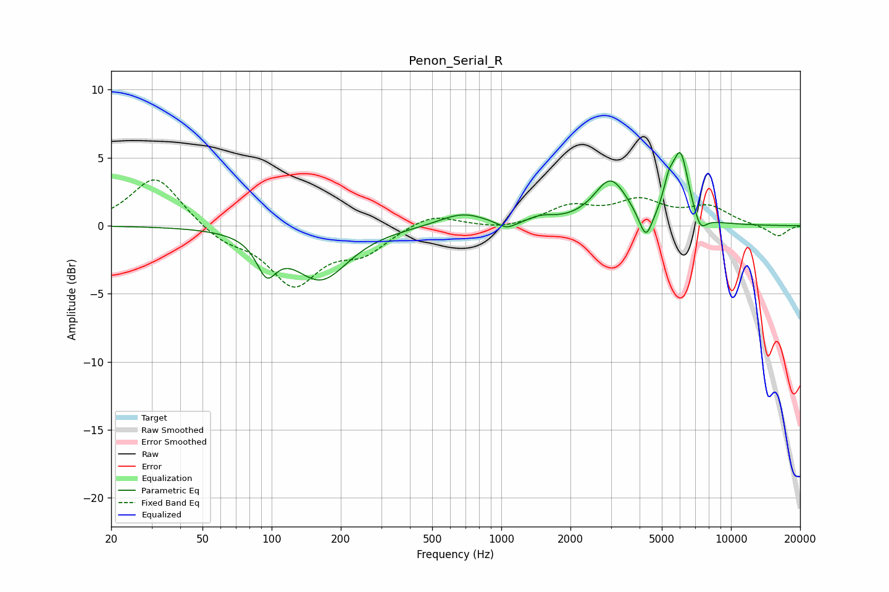

# Penon_Serial_R
See [usage instructions](https://github.com/jaakkopasanen/AutoEq#usage) for more options and info.

### Parametric EQs
Apply preamp of -5.5 dB when using parametric equalizer.

|   # | Type    |   Fc (Hz) |    Q |   Gain (dB) |
|-----|---------|-----------|------|-------------|
|   1 | Peaking |        95 | 3.32 |        -2.5 |
|   2 | Peaking |       164 | 1.19 |        -3.9 |
|   3 | Peaking |       675 | 1.41 |         1   |
|   4 | Peaking |      1058 | 3.35 |        -0.6 |
|   5 | Peaking |      1493 | 2.51 |         0.4 |
|   6 | Peaking |      2991 | 1.99 |         3.3 |
|   7 | Peaking |      4259 | 4.79 |        -2.2 |
|   8 | Peaking |      5353 | 6    |         1.6 |
|   9 | Peaking |      6029 | 3.86 |         4.9 |
|  10 | Peaking |      7349 | 4.84 |        -1.3 |

### Fixed Band EQs
When using fixed band (also called graphic) equalizer, apply preamp of **-3.5 dB** (if available) and set gains manually with these parameters.

|   # | Type    |   Fc (Hz) |    Q |   Gain (dB) |
|-----|---------|-----------|------|-------------|
|   1 | Peaking |        31 | 1.41 |         3.7 |
|   2 | Peaking |        62 | 1.41 |        -1.1 |
|   3 | Peaking |       125 | 1.41 |        -4.2 |
|   4 | Peaking |       250 | 1.41 |        -1.7 |
|   5 | Peaking |       500 | 1.41 |         1   |
|   6 | Peaking |      1000 | 1.41 |        -0.3 |
|   7 | Peaking |      2000 | 1.41 |         1.3 |
|   8 | Peaking |      4000 | 1.41 |         1.7 |
|   9 | Peaking |      8000 | 1.41 |         1.3 |
|  10 | Peaking |     16000 | 1.41 |        -0.8 |

### Graphs

