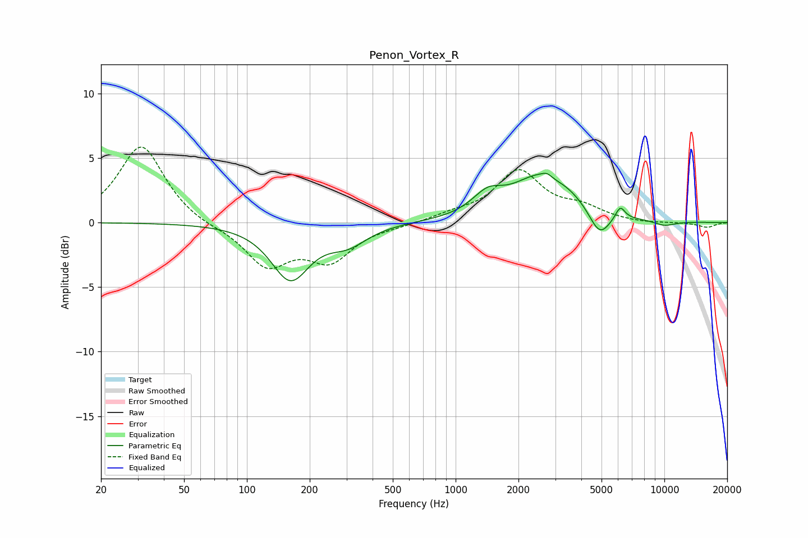

# Penon_Vortex_R
See [usage instructions](https://github.com/jaakkopasanen/AutoEq#usage) for more options and info.

### Parametric EQs
Apply preamp of -3.9 dB when using parametric equalizer.

|   # | Type    |   Fc (Hz) |    Q |   Gain (dB) |
|-----|---------|-----------|------|-------------|
|   1 | Peaking |       162 | 1.55 |        -4.3 |
|   2 | Peaking |       305 | 1.5  |        -1.4 |
|   3 | Peaking |      1289 | 2.17 |         0.3 |
|   4 | Peaking |      1444 | 2.14 |         1.2 |
|   5 | Peaking |      2703 | 0.93 |         3.9 |
|   6 | Peaking |      2743 | 6    |         0.3 |
|   7 | Peaking |      2893 | 2.5  |        -0.5 |
|   8 | Peaking |      4894 | 2.68 |        -2.2 |
|   9 | Peaking |      6146 | 6    |         1   |
|  10 | Peaking |     10000 | 2.22 |        -0.4 |

### Fixed Band EQs
When using fixed band (also called graphic) equalizer, apply preamp of **-5.9 dB** (if available) and set gains manually with these parameters.

|   # | Type    |   Fc (Hz) |    Q |   Gain (dB) |
|-----|---------|-----------|------|-------------|
|   1 | Peaking |        31 | 1.41 |         6   |
|   2 | Peaking |        62 | 1.41 |        -0.3 |
|   3 | Peaking |       125 | 1.41 |        -3.2 |
|   4 | Peaking |       250 | 1.41 |        -2.7 |
|   5 | Peaking |       500 | 1.41 |        -0.2 |
|   6 | Peaking |      1000 | 1.41 |         0.5 |
|   7 | Peaking |      2000 | 1.41 |         3.9 |
|   8 | Peaking |      4000 | 1.41 |         1   |
|   9 | Peaking |      8000 | 1.41 |        -0.1 |
|  10 | Peaking |     16000 | 1.41 |        -0.4 |

### Graphs

