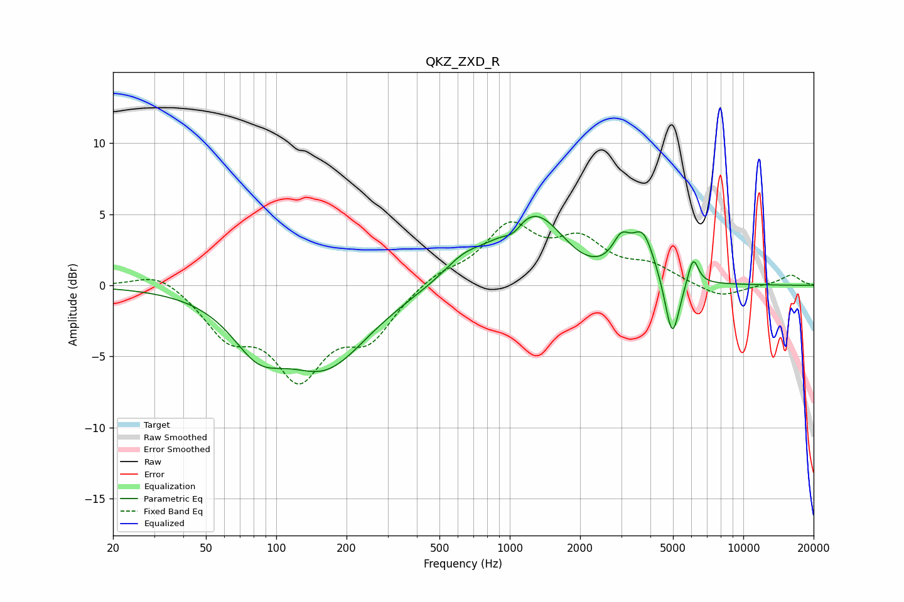

# QKZ_ZXD_R
See [usage instructions](https://github.com/jaakkopasanen/AutoEq#usage) for more options and info.

### Parametric EQs
Apply preamp of -4.9 dB when using parametric equalizer.

|   # | Type    |   Fc (Hz) |    Q |   Gain (dB) |
|-----|---------|-----------|------|-------------|
|   1 | Peaking |        84 | 1.26 |        -3.2 |
|   2 | Peaking |       163 | 0.78 |        -5.3 |
|   3 | Peaking |       632 | 1.59 |         1.2 |
|   4 | Peaking |      1035 | 3.41 |        -0.9 |
|   5 | Peaking |      1253 | 0.97 |         5.3 |
|   6 | Peaking |      2044 | 1.35 |        -0.7 |
|   7 | Peaking |      3001 | 3.73 |         1.9 |
|   8 | Peaking |      3725 | 2.81 |         3.1 |
|   9 | Peaking |      4965 | 4.5  |        -4.5 |
|  10 | Peaking |      6095 | 6    |         2   |

### Fixed Band EQs
When using fixed band (also called graphic) equalizer, apply preamp of **-4.6 dB** (if available) and set gains manually with these parameters.

|   # | Type    |   Fc (Hz) |    Q |   Gain (dB) |
|-----|---------|-----------|------|-------------|
|   1 | Peaking |        31 | 1.41 |         1.1 |
|   2 | Peaking |        62 | 1.41 |        -3.1 |
|   3 | Peaking |       125 | 1.41 |        -5.9 |
|   4 | Peaking |       250 | 1.41 |        -3.3 |
|   5 | Peaking |       500 | 1.41 |         0.9 |
|   6 | Peaking |      1000 | 1.41 |         3.9 |
|   7 | Peaking |      2000 | 1.41 |         2.8 |
|   8 | Peaking |      4000 | 1.41 |         1.2 |
|   9 | Peaking |      8000 | 1.41 |        -0.9 |
|  10 | Peaking |     16000 | 1.41 |         0.7 |

### Graphs

