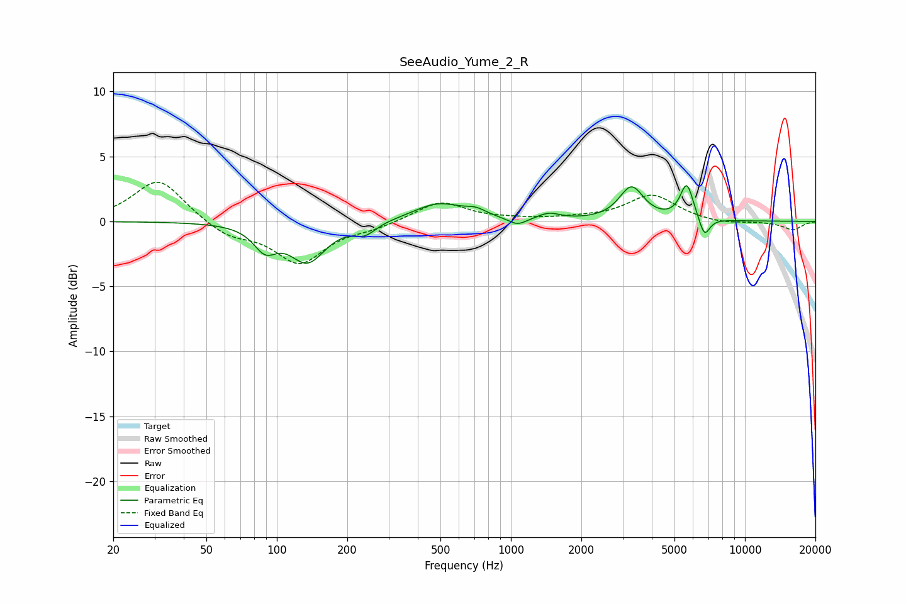

# SeeAudio_Yume_2_R
See [usage instructions](https://github.com/jaakkopasanen/AutoEq#usage) for more options and info.

### Parametric EQs
Apply preamp of -2.8 dB when using parametric equalizer.

|   # | Type    |   Fc (Hz) |    Q |   Gain (dB) |
|-----|---------|-----------|------|-------------|
|   1 | Peaking |        89 | 2.9  |        -1.7 |
|   2 | Peaking |       135 | 1.87 |        -3   |
|   3 | Peaking |       238 | 3.09 |        -0.8 |
|   4 | Peaking |       489 | 1.31 |         1.4 |
|   5 | Peaking |       710 | 3.24 |         0.5 |
|   6 | Peaking |      1067 | 3.58 |        -0.6 |
|   7 | Peaking |      1453 | 2.99 |         0.5 |
|   8 | Peaking |      3275 | 2.72 |         2.6 |
|   9 | Peaking |      5643 | 4.92 |         2.8 |
|  10 | Peaking |      6715 | 5.99 |        -1.5 |

### Fixed Band EQs
When using fixed band (also called graphic) equalizer, apply preamp of **-3.1 dB** (if available) and set gains manually with these parameters.

|   # | Type    |   Fc (Hz) |    Q |   Gain (dB) |
|-----|---------|-----------|------|-------------|
|   1 | Peaking |        31 | 1.41 |         3.3 |
|   2 | Peaking |        62 | 1.41 |        -1.1 |
|   3 | Peaking |       125 | 1.41 |        -3.1 |
|   4 | Peaking |       250 | 1.41 |        -0.4 |
|   5 | Peaking |       500 | 1.41 |         1.5 |
|   6 | Peaking |      1000 | 1.41 |         0.1 |
|   7 | Peaking |      2000 | 1.41 |         0.2 |
|   8 | Peaking |      4000 | 1.41 |         2   |
|   9 | Peaking |      8000 | 1.41 |        -0.2 |
|  10 | Peaking |     16000 | 1.41 |        -0.6 |

### Graphs

