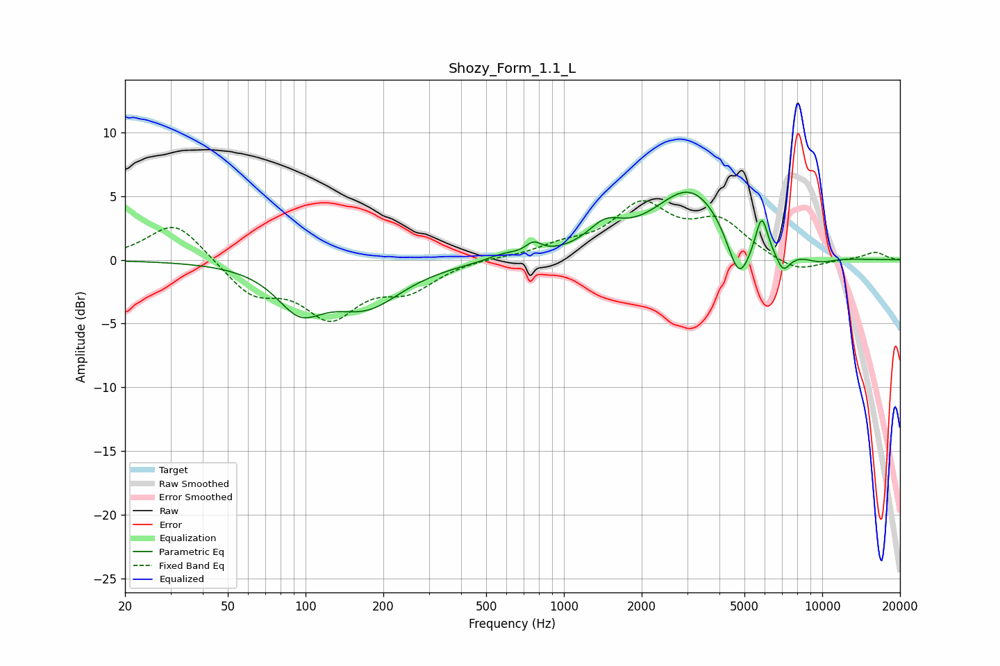

# Shozy_Form_1.1_L
See [usage instructions](https://github.com/jaakkopasanen/AutoEq#usage) for more options and info.

### Parametric EQs
Apply preamp of -5.4 dB when using parametric equalizer.

|   # | Type    |   Fc (Hz) |    Q |   Gain (dB) |
|-----|---------|-----------|------|-------------|
|   1 | Peaking |        95 | 1.59 |        -3.2 |
|   2 | Peaking |       172 | 1.01 |        -3.4 |
|   3 | Peaking |       581 | 2.38 |         0.4 |
|   4 | Peaking |       763 | 4.55 |         0.9 |
|   5 | Peaking |      1444 | 2.09 |         1.8 |
|   6 | Peaking |      3107 | 0.97 |         5.6 |
|   7 | Peaking |      4756 | 3.07 |        -4   |
|   8 | Peaking |      5828 | 5.98 |         2.9 |
|   9 | Peaking |      7047 | 4.66 |        -1.6 |
|  10 | Peaking |      9758 | 2.04 |        -0.5 |

### Fixed Band EQs
When using fixed band (also called graphic) equalizer, apply preamp of **-4.7 dB** (if available) and set gains manually with these parameters.

|   # | Type    |   Fc (Hz) |    Q |   Gain (dB) |
|-----|---------|-----------|------|-------------|
|   1 | Peaking |        31 | 1.41 |         3.1 |
|   2 | Peaking |        62 | 1.41 |        -2.6 |
|   3 | Peaking |       125 | 1.41 |        -4.1 |
|   4 | Peaking |       250 | 1.41 |        -2   |
|   5 | Peaking |       500 | 1.41 |         0.2 |
|   6 | Peaking |      1000 | 1.41 |         0.9 |
|   7 | Peaking |      2000 | 1.41 |         4   |
|   8 | Peaking |      4000 | 1.41 |         2.8 |
|   9 | Peaking |      8000 | 1.41 |        -1.1 |
|  10 | Peaking |     16000 | 1.41 |         0.6 |

### Graphs

